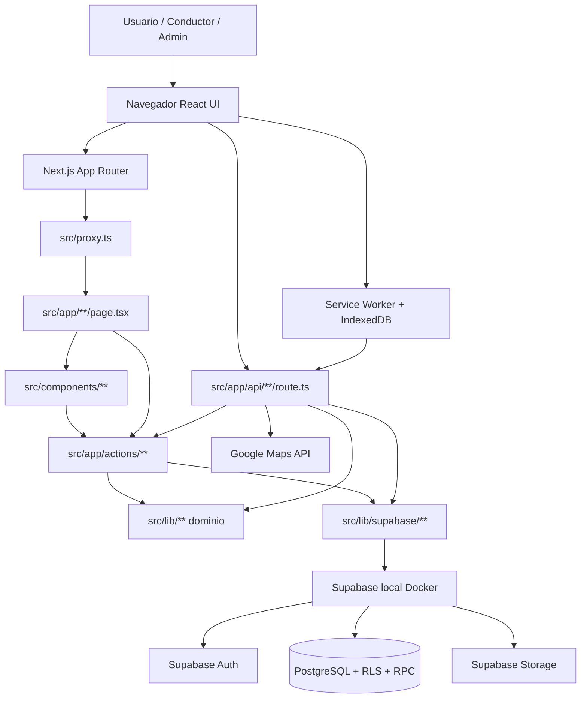
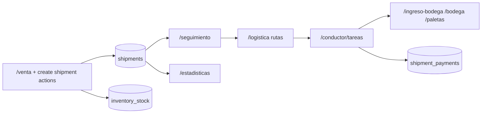

# 01 — Mapa técnico del proyecto Boxario

Documento de solo lectura generado a partir del código y la configuración reales del repositorio.  
Fecha de análisis: **2026-08-02**.  
Alcance: descripción del sistema actual. Sin evaluación de calidad ni recomendaciones.

Fuentes cruzadas usadas como evidencia secundaria (no sustituyen el código):

- `docs/ARQUITECTURA.md`
- `docs/MAPA_FUNCIONAL_ACTUAL.md`
- `docs/GUIA_DESARROLLO.md`
- `docs/DECISIONES_TECNICAS_Y_COMPATIBILIDAD.md`
- `package.json`, `next.config.ts`, `supabase/config.toml`, `.env.example`, `.env.local.template`

---

## 1. Resumen del proyecto

Boxario es una aplicación web **monolítica Next.js** (App Router) para operación de **paquetería / envíos internacionales de cajas**. El eje operativo es la venta de envío (`shipments`) y su ciclo físico: caja vacía → recolección de caja llena → bodega → paletas → proveedor.

El repositorio contiene **una sola aplicación npm** (`package.json` → `"name": "Boxario"`), no un monorepo de paquetes. Frontend y backend conviven en el mismo proceso Next.js:

- UI: React Server/Client Components en `src/app` y `src/components`
- Casos de uso: Server Actions en `src/app/actions` (`"use server"`)
- Dominio TypeScript: `src/lib`
- Persistencia: **PostgreSQL local vía Supabase CLI (Docker)** con RLS, triggers y RPCs en `supabase/migrations`
- Auth: **Supabase Auth** (cookies vía `@supabase/ssr`)
- Capa HTTP REST reducida: pocas rutas en `src/app/api/**`

Modelo multi-organización: cada usuario pertenece a una organización (`profiles` / `organization_memberships`). Existe además un rol de **platform admin** (`platform_admins`) para la consola `/platform`.

---

## 2. Tecnologías detectadas

| Tecnología | Uso | Evidencia |
| --- | --- | --- |
| TypeScript | Lenguaje principal de la app | `tsconfig.json`, `src/**/*.ts(x)` |
| JavaScript (ESM `.mjs`) | Scripts CLI, tests de integración/e2e | `scripts/**/*.mjs`, `tests/**/*.mjs` |
| PowerShell | Scripts de arranque local en Windows | `scripts/start-dev-server.ps1`, `scripts/use-local-env.ps1` |
| SQL (PostgreSQL) | Esquema, RLS, RPC, seeds | `supabase/migrations/*.sql`, `supabase/seed.sql` |
| React 19 | UI | `package.json` → `react` / `react-dom` `19.2.4` |
| Next.js 16 (App Router) | Framework full-stack | `package.json` → `next` `16.2.11`; `src/app/**` |
| Tailwind CSS v4 | Estilos | `package.json` → `tailwindcss` `^4`; `src/app/globals.css` (`@import "tailwindcss"`); `postcss.config.mjs` |
| PostCSS | Pipeline CSS | `postcss.config.mjs` + `@tailwindcss/postcss` |
| Lucide React | Iconos | `package.json` → `lucide-react` |
| qrcode.react | QR en UI | `package.json` → `qrcode.react` |
| ExcelJS | Import/export Excel | `package.json` → `exceljs` |
| sharp | Procesamiento de imágenes | `package.json` → `sharp` |
| npm | Gestor de paquetes | `package-lock.json` |
| Turbopack (Next) | Bundling en desarrollo | `next.config.ts` → `turbopack.root` |
| ESLint 9 + eslint-config-next | Linter | `eslint.config.mjs`, `package.json` scripts `lint` |
| TypeScript Compiler (`tsc --noEmit`) | Typecheck | `package.json` → `typecheck` |
| Knip | Detección de código/deps no usados | `knip.json`, script `check:code` |
| jscpd | Detección de duplicación | script `check:duplicates` |
| Node.js test runner + `tsx` | Pruebas unitarias/gate/eval | `scripts/run-tests.mjs` (`tsx --test`) |
| Playwright | E2E | `@playwright/test`, `playwright.config.mjs`, `tests/e2e` |
| fake-indexeddb | Tests de cola offline | `package.json` devDependency |
| pg | Cliente PostgreSQL en scripts | `package.json` → `pg`; `scripts/lib/db-connection.mjs` |
| Supabase JS / SSR | Cliente Auth + DB + Storage | `@supabase/supabase-js`, `@supabase/ssr` |
| Supabase CLI (local) | API, Auth, DB, Studio, Storage en Docker | `supabase/config.toml`; scripts `supabase:start` |
| PostgreSQL 17 | Base de datos | `supabase/config.toml` → `[db].major_version = 17` |
| Google Maps Places / Geocode API | Validación/autocompletado de direcciones | `src/app/api/validate-address/route.ts` (`GOOGLE_MAPS_API_KEY`) |
| Service Worker / PWA | Offline conductor | `public/sw.js`, `src/app/manifest.ts`, `src/lib/conductor-offline/**` |
| IndexedDB | Cola offline del conductor | `src/lib/conductor-offline/README.md` |

**No detectado en el repositorio (con evidencia negativa):**

| Elemento | Evidencia |
| --- | --- |
| Prettier / formateador dedicado | No hay `.prettierrc` ni `prettier` en `package.json` |
| CI/CD en GitHub Actions u otro | No existe carpeta `.github` |
| Dockerfile / docker-compose de la app | No hay `Dockerfile` ni `docker-compose*` (Docker se usa vía Supabase CLI) |
| `vercel.json` / config de despliegue | Ausente; solo aparece `VERCEL_URL` como lectura opcional en `src/lib/auth/dev-auth-bypass.ts` |
| README raíz | No hay `README.md` en la raíz |
| ORM clásico (Prisma/Drizzle) | Acceso vía cliente Supabase + SQL/RPC; tipos en `src/lib/db/database.generated.ts` |
| Stripe / pasarela de pagos externa | No hay dependencia ni integración de cobro online; pagos operativos en tablas/RPC propias |
| Proveedor de correo transaccional | `src/lib/email/domains.ts` solo sugiere dominios de email en UI |
| Proveedor SMS externo en runtime de app | UI/login indica que SMS no se envía; `scripts/test-sms-flow.mjs` existe como script de prueba |

---

## 3. Estructura general del repositorio

```text
Boxario/
├── src/                    # Aplicación Next.js (UI + server actions + dominio)
├── supabase/               # Config local Supabase, migraciones SQL, seeds
├── scripts/                # CLI admin, seeds, quality gates, DB tools
├── tests/                  # E2E Playwright + algunos eval de integración
├── docs/                   # Documentación de arquitectura, negocio, UI, fases
├── public/                 # Estáticos PWA (sw.js, offline.html, icono)
├── output/                 # Artefactos de pruebas (gitignoreado en parte)
├── .env.example            # Plantilla de variables (local)
├── .env.local.template     # Plantilla alternativa para copiar a .env.local
├── package.json            # Dependencias y scripts npm
├── next.config.ts          # Next: CSP, redirects, turbopack, allowedDevOrigins
├── tsconfig.json           # Paths `@/*` → `src/*`
├── eslint.config.mjs
├── playwright.config.mjs
├── knip.json
├── postcss.config.mjs
└── AGENTS.md               # Instrucciones para agentes / contribución
```

### Carpetas importantes

| Carpeta | Categoría | Propósito | Quién la usa |
| --- | --- | --- | --- |
| `src/app/` | Frontend + Backend (rutas Next) | App Router: `page.tsx`, layouts, `api/**/route.ts`, `actions/**` | Next.js en runtime |
| `src/components/` | Frontend | Componentes de pantallas y UI compartida | Páginas en `src/app` |
| `src/lib/` | Dominio / infra TS | Reglas de negocio TS, auth, supabase clients, mappers, helpers | Actions, pages, components, tests |
| `src/hooks/` | Frontend | Hooks React reutilizables | Components |
| `src/data/` | Datos estáticos | p. ej. `country-centroids.json` | Lib/UI de mapas/países |
| `src/test-utils/` | Pruebas | Fuentes/helpers para tests de arquitectura de módulos | Tests `*.eval.test.ts` |
| `src/proxy.ts` | Backend edge/middleware | Gate de sesión Supabase (equiv. middleware Next) | Next request pipeline |
| `supabase/migrations/` | Base de datos | 166 migraciones SQL numeradas (`001`…`166`) | `supabase db reset`, `npm run db:apply` |
| `supabase/` (`config.toml`, `seed.sql`, `seed-bootstrap.sql`) | Infra local DB | Arranque Supabase + seeds | CLI Supabase / scripts |
| `scripts/` | Admin / tooling | Seeds demo, integrity tests, codegen, quality | npm scripts |
| `scripts/lib/` | Tooling compartido | Conexión PG, env local, architecture health, test discovery | Scripts |
| `tests/e2e/` | Pruebas E2E | Playwright | `npm run test:e2e` |
| `tests/integration/` | Pruebas eval | Checks de hardening/código | `npm run test:eval` (vía discovery) |
| `docs/` | Documentación | Arquitectura, reglas de negocio, UI, fases | Humanos / agentes |
| `public/` | Frontend estático | Service worker, offline page, icono PWA | Navegador |
| `output/` | Artefactos | Resultados Playwright / user tests | Generado |
| `.next/` | Build generado | Compilación Next | Ignorar en análisis |
| `node_modules/` | Dependencias | Instaladas por npm | Runtime/build |
| `.codex-remote-attachments/` | Auxiliar | Adjuntos de herramientas | No es runtime de producto |
| `.jscpd-report/` | Reportes | Salida jscpd | Quality tooling |

---

## 4. Aplicaciones y servicios

El repositorio **no** contiene varias apps npm ni paquetes compartidos publicados. Contiene:

### 4.1 Aplicación web Boxario (única app)

| Campo | Detalle |
| --- | --- |
| Nombre | Boxario |
| Carpeta | `src/` (+ config raíz) |
| Entrada framework | Next.js App Router (`src/app/layout.tsx`, `src/app/page.tsx`) |
| Arranque dev | `npm run dev` / `npm run up` (`scripts/dev-up.mjs`) |
| Arranque prod local | `npm run build` + `npm run start` |
| Dependencias principales | `next`, `react`, `@supabase/ssr`, `@supabase/supabase-js`, `tailwindcss`, `lucide-react`, `exceljs`, `sharp`, `qrcode.react` |
| Responsabilidades | UI operativa, server actions, APIs HTTP puntuales, sesión, PWA conductor |

### 4.2 Stack de datos local Supabase

| Campo | Detalle |
| --- | --- |
| Nombre | Proyecto Supabase local `boxario` |
| Carpeta | `supabase/` |
| Arranque | `npm run supabase:start` → `npx supabase start` |
| Puertos (config) | API `60021`, DB `60022`, Studio `60023` (`supabase/config.toml`) |
| Responsabilidades | PostgreSQL, Auth, Storage, Realtime, API PostgREST |

### 4.3 Scripts administrativos (no son servicios persistentes)

Ubicación: `scripts/*.mjs` (+ `.ps1`). Cubren seeds demo SCGS, wipe/reset, integrity DB, codegen de tipos, backups git, benchmarks, security checks. Se invocan vía `package.json` scripts `db:*`, `test:*`, `quality:*`, `codegen:*`.

### 4.4 PWA / worker del navegador

| Campo | Detalle |
| --- | --- |
| Manifest | `src/app/manifest.ts` (nombre “Boxario Conductores”, `start_url: /conductor/tareas`) |
| Service worker | `public/sw.js` |
| Cola offline | `src/lib/conductor-offline/**` + API `src/app/api/conductor/task-results/route.ts` |

### 4.5 Lo que no hay

- Aplicaciones móviles nativas
- Funciones serverless separadas (más allá del runtime de rutas Next)
- Workers de cola server-side (Bull/Sidekiq/etc.) — la cola offline es **client-side** IndexedDB
- Microservicios independientes
- Paquetes internos tipo `packages/*`

---

## 5. Puntos de entrada

### Runtime aplicación

| Rol | Ruta |
| --- | --- |
| Layout raíz / bootstrap UI | `src/app/layout.tsx` |
| Home autenticada | `src/app/page.tsx` |
| Proxy/middleware de auth | `src/proxy.ts` (`export async function proxy`, `export const config.matcher`) |
| Estilos globales | `src/app/globals.css` |
| Manifest PWA | `src/app/manifest.ts` |
| Service worker | `public/sw.js` |

### Autenticación HTTP

| Rol | Ruta |
| --- | --- |
| Sign-in | `src/app/api/auth/sign-in/route.ts` |
| Session JSON | `src/app/api/auth/session/route.ts` |
| Login UI | `src/app/login/page.tsx` (+ `login-form.tsx`) |

### APIs HTTP internas

| Rol | Ruta |
| --- | --- |
| Tracking público | `src/app/api/public/tracking/route.ts` |
| Validación dirección (Google) | `src/app/api/validate-address/route.ts` |
| Sync resultados conductor (offline) | `src/app/api/conductor/task-results/route.ts` |

### Casos de uso (server actions)

| Rol | Ruta |
| --- | --- |
| Barril / módulos de dominio | `src/app/actions/*.ts` (p. ej. `shipments.ts`, `shipments-create.ts`, `inventory.ts`, `logistics-routes.ts`, `conductor-tasks.ts`, `auth.ts`, `platform.ts`, …) |

### Infraestructura de datos

| Rol | Ruta |
| --- | --- |
| Migraciones | `supabase/migrations/001_*.sql` … `166_*.sql` |
| Seed post-reset | `supabase/seed.sql` → referencia `seed-bootstrap.sql` |
| Aplicación incremental de migraciones | `scripts/apply-migrations.mjs` (`npm run db:apply`) |
| Reset local | `npm run db:local:reset` → `supabase db reset` |
| Codegen tipos DB | `scripts/codegen-db-types.mjs` → `src/lib/db/database.generated.ts` |
| Conexión PG scripts | `scripts/lib/db-connection.mjs` |

### Clientes Supabase

| Rol | Ruta |
| --- | --- |
| Env / asserts local-only | `src/lib/supabase/env.ts` |
| Server client (cookies) | `src/lib/supabase/server.ts` |
| Scoped (sesión usuario) | `src/lib/supabase/scoped.ts` |
| Admin (service role) | `src/lib/supabase/admin.ts` |
| URLs firmadas storage | `src/lib/supabase/storage-url.ts` |

### Sesión / auth app

| Rol | Ruta |
| --- | --- |
| Construcción de sesión | `src/lib/auth/session.ts` |
| Gates de ruta | `src/lib/auth/require.ts` |
| Permisos / PATH_PERMISSIONS | `src/lib/auth/permissions.ts` |
| Roles | `src/lib/auth/role-catalog.ts` |
| Paths públicos del proxy | `src/lib/auth/proxy-paths.ts` |

### Pruebas

| Rol | Ruta |
| --- | --- |
| Runner gate/eval | `scripts/run-tests.mjs` |
| Discovery de archivos | `scripts/lib/test-files.mjs` |
| Playwright config | `playwright.config.mjs` |
| E2E setup | `tests/e2e/global-setup.mjs` |

### Desarrollo

| Rol | Ruta |
| --- | --- |
| Orquestador local | `scripts/dev-up.mjs` (`npm run up`) |
| Next config | `next.config.ts` |

---

## 6. Flujo general del sistema

### 6.1 Arranque local típico

1. Variables desde `.env.local` (plantilla `.env.local.template` / `npm run env:local`).
2. `npm run supabase:start` levanta PostgreSQL/Auth/Storage en Docker.
3. `npm run up` o `npm run dev` inicia Next en el puerto de la app (E2E usa `APP_BASE_URL`, por defecto `http://127.0.0.1:3000`).
4. `src/proxy.ts` intercepta requests (salvo estáticos/PWA) y valida sesión Supabase con cookies.

### 6.2 Request autenticada de página

1. Usuario navega a una ruta (p. ej. `/venta`).
2. `src/proxy.ts` exige usuario autenticado salvo paths públicos (`/login`, `/rastrear`, `/api/auth/sign-in`, `/api/public/tracking` — `src/lib/auth/proxy-paths.ts`).
3. `src/app/layout.tsx` llama `getAppSession()` y envuelve con `AppFrame`.
4. La página (`src/app/**/page.tsx`) suele usar `requirePathAccess` (`src/lib/auth/require.ts`) según `PATH_PERMISSIONS`.
5. La UI cliente invoca **Server Actions** (`src/app/actions/**`).
6. La action valida sesión/permisos (`requireAppSession`, `sessionHasPermission`), aplica reglas en `src/lib/**` y habla con Supabase (cliente scoped JWT o admin service role según el caso).
7. Mutaciones críticas delegan en **RPC SQL** (p. ej. `create_shipment_sale_atomic`, `collect_shipment_invoice_payment`, `update_logistics_task_atomic`) definidas en migraciones.
8. RLS / helpers SQL (`user_has_permission`, `current_organization_id`, …) refuerzan aislamiento por organización.
9. La action retorna `ActionResult` (`src/lib/actions/errors.ts`); la UI renderiza el resultado.

### 6.3 Ejemplo concreto: crear venta

1. UI: `/venta` → `src/app/venta/page.tsx` + componentes en `src/components/sale/**` / `venta-client`.
2. Bootstrap: helpers en `src/lib/sale/**` + actions `sale-bootstrap.ts`.
3. Persistencia: action de creación en `src/app/actions/shipments-create.ts` / `shipments.ts`.
4. Autoridad de escritura de venta: RPC `create_shipment_sale_atomic` (migración `132_atomic_sales_tracking_and_authoritative_writes.sql`, referida en docs/arquitectura).
5. Efectos: filas en `shipments`, `shipment_packages`, `shipment_logistics_tasks`, pagos/reservas de inventario según plan.
6. El envío aparece en `/seguimiento`.

### 6.4 Ejemplo concreto: conductor offline

1. Conductor completa tarea en `/conductor/tareas`.
2. Resultado + foto se escriben primero en IndexedDB (`src/lib/conductor-offline`).
3. Sync vía `POST /api/conductor/task-results` → `submitConductorTaskResultAction`.
4. Evidencia puede subirse a Storage bucket `logistics-task-evidence`.
5. Service worker (`public/sw.js`) puede reintentar con Background Sync.

### 6.5 Tracking público

1. Usuario abre `/rastrear`.
2. Cliente llama `POST /api/public/tracking` con token.
3. Rate limit (`src/lib/security/api-guards.ts`).
4. Lookup admin por hash del token en `shipments` (`public_tracking_token_hash`).

---

## 7. Mapa del frontend

### Framework y entrada

- **Framework:** Next.js 16 App Router + React 19.
- **Entrada UI:** `src/app/layout.tsx` → `AppFrame` (`src/components/app-frame.tsx`) → `AppShell` (`src/components/app-shell.tsx`).
- **Home:** `src/app/page.tsx` (dashboard / home conductor según rol).

### Sistema de rutas

Rutas por filesystem en `src/app/**/page.tsx`. Redirects legacy en `next.config.ts` (`/envios` → `/seguimiento`, `/distribuidores` → `/agencias`, etc.).

**Páginas principales observadas:**

| Ruta | Archivo |
| --- | --- |
| `/` | `src/app/page.tsx` |
| `/login` | `src/app/login/page.tsx` |
| `/venta` | `src/app/venta/page.tsx` |
| `/seguimiento` | `src/app/seguimiento/page.tsx` |
| `/seguimiento/[shipmentId]/expediente` | `src/app/seguimiento/[shipmentId]/expediente/page.tsx` |
| `/seguimiento/historial` | `src/app/seguimiento/historial/page.tsx` |
| `/seguimiento/excepciones` | `src/app/seguimiento/excepciones/page.tsx` |
| `/inventario` | `src/app/inventario/page.tsx` |
| `/ingreso-bodega` | `src/app/ingreso-bodega/page.tsx` |
| `/bodega` | `src/app/bodega/page.tsx` |
| `/paletas` | `src/app/paletas/page.tsx` |
| `/logistica` | `src/app/logistica/page.tsx` |
| `/logistica/vehiculos` | `src/app/logistica/vehiculos/page.tsx` |
| `/logistica/conductores` | `src/app/logistica/conductores/page.tsx` |
| `/conductor/tareas` | `src/app/conductor/tareas/page.tsx` |
| `/conductor/inventario-camion` | `src/app/conductor/inventario-camion/page.tsx` |
| `/contabilidad` | `src/app/contabilidad/page.tsx` |
| `/estadisticas` | `src/app/estadisticas/page.tsx` |
| `/configuracion` | `src/app/configuracion/page.tsx` |
| `/platform` | `src/app/platform/page.tsx` |
| `/perfil` | `src/app/perfil/page.tsx` |
| `/rastrear` | `src/app/rastrear/page.tsx` |
| `/reloj`, `/time-clock` | `src/app/reloj/page.tsx`, `src/app/time-clock/page.tsx` |
| Agencias / captación / solicitudes | `src/app/agencia/**`, `agencias/**`, `captacion`, `solicitudes` |
| Distribución / vendedores | `src/app/distribuidor`, `distribuidores`, `mis-distribuidores`, `vendedores/**` |

Menú: `src/components/app-shell.tsx` + navegación en `src/lib/app-navigation.ts`.

### Componentes importantes (por carpeta)

| Carpeta | Contenido típico |
| --- | --- |
| `src/components/sale/` | Flujo de venta multi-paso |
| `src/components/envios/` | Seguimiento de envíos |
| `src/components/logistica/` | Board de rutas |
| `src/components/conductor/` | Tareas / home conductor |
| `src/components/inventory/` | Inventario SKU |
| `src/components/warehouse/` | Ingreso bodega / paletas |
| `src/components/config/` | Paneles de configuración |
| `src/components/platform/` | Consola plataforma |
| `src/components/onboarding/` | Coach / tutorial |
| `src/components/notifications/` | Toasts/notificaciones UI |
| `src/components/ui/` | Preferencias de superficie / primitives |
| Root (`app-shell.tsx`, `envios-client.tsx`, `inventario-client.tsx`, …) | Clientes de página |

### Manejo de estado

- **No** hay Redux/Zustand/Jotai detectados en dependencias.
- Estado de UI: React `useState` / Context locales (`AppFrame` shell config, `NotificationProvider`, `UiSurfacePreferencesProvider`, onboarding contexts).
- Estado de servidor: Server Components + Server Actions; revalidación implícita de Next.
- Offline conductor: cola IndexedDB (`src/lib/conductor-offline`).
- Preferencias UI de superficie: `src/lib/ui-surface-*.ts` + provider en components.

### Comunicación con backend

- Primario: **Server Actions** importadas desde `@/app/actions/...`.
- Secundario: `fetch` a rutas `/api/*` (login, tracking, validate-address, task-results).
- No hay capa React Query/SWR en `package.json`.

### Autenticación (frontend)

- Login form → `POST /api/auth/sign-in`.
- Sesión vía cookies Supabase; layout llama `getAppSession()`.
- Paths públicos limitados; resto redirige a `/login` desde `src/proxy.ts`.

### Estilos

- Tailwind v4 + CSS variables en `:root` (`src/app/globals.css`), `color-scheme: dark`.
- Temas/superficies por ruta: `ui-surface-themes`, `ui-surface-palettes`, etc.
- Iconos Lucide.

### Variables de entorno usadas por frontend/runtime Next

Ver sección 11. Las públicas típicas son `NEXT_PUBLIC_SUPABASE_URL`, `NEXT_PUBLIC_SUPABASE_ANON_KEY`, y opcionalmente `NEXT_PUBLIC_APP_URL` / `NEXT_PUBLIC_GOOGLE_MAPS_API_KEY` / `NEXT_PUBLIC_APP_ORIGIN`.

### Scripts de desarrollo/compilación

- `npm run dev`, `dev:open`, `dev:kill`, `up` / `dev:up`
- `npm run build`, `npm run start`
- `npm run lint`, `npm run typecheck`

---

## 8. Mapa del backend

En este proyecto el “backend” es el **servidor Next.js** + **PostgreSQL/Supabase**, no un servidor Express separado.

### Framework y entrada

- Next.js Route Handlers + Server Actions.
- Gate transversal: `src/proxy.ts`.

### Rutas / controladores

1. **HTTP** (`src/app/api/**/route.ts`): auth, tracking, validate-address, conductor task-results.
2. **Server Actions** (`src/app/actions/**`): superficie principal de mutación/consulta.

Módulos de actions (agrupados por nombre de archivo):

- Envíos: `shipments*.ts`, `shipment-journal.ts`, `shipment-expediente.ts`
- Inventario: `inventory*.ts`, `inventory/**`
- Logística: `logistics-*.ts`
- Conductor: `conductor-*.ts`
- Clientes: `customers*.ts`, `customer-route-assignments/**`
- Org/usuarios/roles: `organization.ts`, `users.ts`, `roles.ts`, `profile.ts`
- Agencias/distribución: `agencies.ts`, `agency-*.ts`, `distribution*.ts`
- Precios/comercial: `pricing.ts`, `commercial-config.ts`, `axis-settings.ts`
- Plataforma/onboarding/time-clock/business: `platform.ts`, `onboarding.ts`, `time-clock.ts`, `business-*.ts`
- Auth/session: `auth.ts`, `session.ts`

### Servicios / lógica de negocio

- Dominio TypeScript en `src/lib/**` (máquinas de estado, billing preview, custody, inventory helpers, etc.).
- Autoridad fuerte en **SQL RPC/triggers** (`supabase/migrations`).
- Documentado en `docs/ARQUITECTURA.md` (capas UI → actions → lib → supabase/db → PostgreSQL).

### Acceso a datos

- `createScopedSupabase(session)` → JWT del usuario + RLS.
- `createSupabaseAdminClient()` → service role (operaciones privilegiadas / storage / lookups controlados).
- Scripts: `pg` directo (`scripts/lib/db-connection.mjs`).
- Tipos: `src/lib/db/database.generated.ts` + aliases `src/lib/db/index.ts`.

### Middleware

- `src/proxy.ts`: sesión, redirects login, header `x-boxario-pathname`.
- Guards de API: `src/lib/security/api-guards.ts` (rate limits login/tracking).
- Org-scope: `src/lib/security/org-scope.ts`.
- Arquitectura enforceada offline por `scripts/check-architecture.mjs` (no es middleware HTTP).

### Autenticación y autorización

- Auth identity: Supabase Auth.
- App session: `src/lib/auth/session.ts` (perfil, org, rol, platform admin, URLs firmadas de avatar/logo).
- Permisos: catálogo SQL (`permissions`, `role_permissions`) + `sessionHasPermission` / `PATH_PERMISSIONS`.
- Platform: tabla `platform_admins` + `PLATFORM_OWNER_EMAIL`.
- Dev bypass opcional: `DEV_AUTH_BYPASS` (`src/lib/auth/dev-auth-bypass.ts`) solo fuera de producción y con Supabase local.

### Validación

- Validación de entrada en actions + helpers de dominio (`src/lib/**`).
- Validación de dinero/stock/transiciones críticas en SQL.
- Imágenes: `src/lib/security/safe-image.ts`.
- Cantidades: `src/lib/security/qty.ts`.

### Trabajos en segundo plano

- No hay worker server persistente en el repo.
- Offline sync del conductor + service worker.
- Scripts one-shot (seeds, integrity) lanzados manualmente.

### Integraciones externas

Ver sección 10.

### Configuración

- `next.config.ts` (CSP, redirects, body size proxy 10mb, allowedDevOrigins para tunnels).
- `supabase/config.toml`.
- Env files (sección 11).
- Enforce local-only hacia Supabase cloud en `src/lib/supabase/env.ts` (`assertLocalOnly` rechaza `supabase.co`).

---

## 9. Mapa de la base de datos

### Tipo y cliente

| Ítem | Valor | Evidencia |
| --- | --- | --- |
| Motor | PostgreSQL 17 | `supabase/config.toml` |
| Host local típico | `127.0.0.1:60022` | `.env.example` / template |
| Acceso app | Supabase JS (PostgREST + RPC) | `src/lib/supabase/*` |
| Acceso scripts | `pg` | `scripts/lib/db-connection.mjs` |
| Tipos generados | `src/lib/db/database.generated.ts` | codegen scripts |

### Modelos / esquemas

- Fuente de verdad del esquema: `supabase/migrations/*.sql` (166 archivos).
- Tipos TS generados (no ORM): `src/lib/db/database.generated.ts`.
- Adaptadores: `src/lib/db/index.ts`.

### Migraciones y seeds

| Artefacto | Ruta |
| --- | --- |
| Migraciones | `supabase/migrations/001_roles_permissions_warehouses.sql` … `166_shipment_authoritative_guard_definer.sql` |
| Tracking app de migraciones aplicadas (scripts) | tabla `app_schema_migrations` vía `scripts/apply-migrations.mjs` |
| Seed reset | `supabase/seed.sql` |
| Bootstrap org demo | `supabase/seed-bootstrap.sql` |
| Seeds operativos npm | `scripts/seed-*.mjs` (`db:seed:*`) |

### Entidades principales (tablas `public`)

Hay **136 tablas** tipadas en `database.generated.ts`. Grupos principales:

| Dominio | Tablas representativas |
| --- | --- |
| Tenancy / auth app | `organizations`, `profiles`, `organization_memberships`, `roles`, `permissions`, `role_permissions`, `platform_admins`, `business_tenants` |
| Clientes | `customers`, `customer_recipients`, `customer_route_assignment_requests`, `customer_route_verifications` |
| Envíos | `shipments`, `shipment_packages`, `shipment_payments`, `shipment_logistics_tasks`, `shipment_logistics_task_attempts`, `shipment_contact_logs`, `shipment_journal_entries`, `shipment_sale_operations`, `shipment_package_invoice_events` |
| Precios | `pricing_countries`, `pricing_country_boxes`, `pricing_promotions` |
| Inventario SKU | `warehouses`, `warehouse_bins`, `inventory_categories`, `inventory_items`, `inventory_stock`, `inventory_movements`, `inventory_sale_reservations`, `inventory_assignments`, `inventory_warehouse_transfers`, `inventory_bin_stock` |
| Logística | `logistics_routes`, `logistics_route_stops`, `logistics_route_templates`, `logistics_vehicles`, `logistics_truck_inventory_events`, `logistics_route_notifications`, `logistics_weekday_defaults` |
| Bodega física | `warehouse_intake_sessions`, `warehouse_intake_items`, `warehouse_intake_events`, `warehouse_pallets`, `package_custody_events`, `package_custody_handoffs` |
| Agencias | `agencies`, `agency_*` (visitas, cobros, precios, cajas, cierres, …) |
| Distribución | `distributors`, `distribution_partners`, `distribution_partner_ledger`, … |
| Contabilidad experimental | `gl_accounts`, `journal_entries`, `journal_lines`, `accounting_periods`, `customer_invoices`, `driver_settlements`, `financial_holds`, … |
| Reloj | `time_clock_*` |
| Seguridad / auditoría | `activity_history`, `immutable_audit_events`, `security_audit_events`, `security_rate_limits`, `idempotency_operations` |

**Vistas tipadas (8):**  
`agency_box_lot_balances`, `agency_charge_balances`, `agency_payment_balances`, `current_financial_holds`, `customer_invoice_balances`, `customer_payment_balances`, `driver_settlement_statuses`, `package_custody_current`.

Además existen muchas **functions/RPC** en el esquema `public` (tipadas en la sección `Functions` de `database.generated.ts`), p. ej. `create_shipment_sale_atomic`, `collect_shipment_invoice_payment`, `update_logistics_task_atomic`, `record_inventory_movement_atomic`, `user_has_permission`, etc.

### Relaciones principales (conceptuales, según nombres FK y docs de arquitectura)

```text
organizations 1—* profiles / organization_memberships / warehouses / customers / shipments
customers 1—* customer_recipients / shipments
shipments 1—* shipment_packages / shipment_payments / shipment_logistics_tasks
shipment_logistics_tasks *—1 logistics_routes (vía stops/asignación)
logistics_routes 1—* logistics_route_stops / notifications
inventory_items 1—* inventory_stock (por warehouse)
shipments / tasks ↔ inventory_sale_reservations / inventory_movements
shipment_packages ↔ package_custody_* / warehouse_intake_* / warehouse_pallets
```

### Conexión

| Contexto | Dónde |
| --- | --- |
| App server | `createSupabaseServerClient` / admin en `src/lib/supabase/*` usando `NEXT_PUBLIC_SUPABASE_*` y `SUPABASE_SERVICE_ROLE_KEY` |
| Scripts | `SUPABASE_DB_URL` / `DATABASE_URL` o `SUPABASE_DB_HOST` + `SUPABASE_DB_PORT` + `SUPABASE_DB_PASSWORD` (`scripts/lib/db-connection.mjs`) |

### Variables DB (nombres)

Ver sección 11. No se documentan valores secretos.

### Storage buckets (Supabase Storage)

| Bucket | Evidencia |
| --- | --- |
| `logistics-task-evidence` | `src/lib/conductor-truck-inventory/contracts.ts` |
| `warehouse-intake-evidence` | `src/app/actions/warehouse-intake.ts` |
| `profile-avatars` | `src/lib/account/profile-validation.ts` |
| `organization-logos` | `src/lib/organizations/branding.ts` |
| `logistics-vehicle-photos` | `src/lib/logistics-fleet.ts` |
| `inventory-item-photos` | `src/lib/inventory-photos.ts` |

---

## 10. APIs e integraciones

### APIs internas (Next Route Handlers)

| Endpoint | Responsabilidad | Datos |
| --- | --- | --- |
| `POST /api/auth/sign-in` | Login email/password + cookies | email, password, nextPath → sesión |
| `GET /api/auth/session` | Resumen de sesión | userId, email, role, platform flag |
| `POST /api/public/tracking` | Tracking público por token | token → estado de envío sanitizado |
| `POST /api/validate-address` | Autocomplete/geocode/details Google | query/placeId → sugerencias/dirección |
| `POST /api/conductor/task-results` | Sync offline de resultados de tarea | multipart evidencia + payload → action |

La superficie mayor de API interna es **RPC vía Server Actions**, no REST abierto.

### APIs / proveedores externos

| Integración | Config | Uso | Responsabilidad |
| --- | --- | --- | --- |
| Supabase Auth | `NEXT_PUBLIC_SUPABASE_*`, service role | Login, sesión, usuarios | Identidad |
| Supabase Postgres/PostgREST | misma config | CRUD/RPC | Datos |
| Supabase Storage | service/scoped clients | Evidencias, avatares, logos, fotos | Archivos |
| Google Maps Platform | `GOOGLE_MAPS_API_KEY` (+ opcional pública) | `validate-address` | Direcciones |
| Google Maps URLs (navegación) | sin API key | Links `google.com/maps` en UI conductor/expediente | Deep links |

### Webhooks

No se encontraron endpoints de webhooks entrantes de terceros en `src/app/api`.

### Pagos

No hay Stripe/PayPal/etc. Los cobros operativos viven en `shipment_payments` + RPC `collect_shipment_invoice_payment`.

### Correo / SMS

- Dominios de email: solo autocompletado UI (`src/lib/email/domains.ts`).
- SMS: texto en login indica que no se envían códigos; creación de cliente platform puede abrir `sms:` URI del SO; script `scripts/test-sms-flow.mjs` para pruebas (no es proveedor embebido en la app).

### Analítica / IA

No hay SDKs de analytics ni LLM en `package.json`. `supabase/config.toml` menciona OpenAI solo como opción de Studio local (comentario de config Supabase), no como integración de producto.

---

## 11. Configuración y variables de entorno

### Archivos de configuración

| Archivo | Rol |
| --- | --- |
| `.env.example` | Ejemplo documentado (local) |
| `.env.local.template` | Plantilla para copiar a `.env.local` |
| `.env.local` | Env real local (no versionar secretos) |
| `next.config.ts` | Next / seguridad HTTP |
| `tsconfig.json` | TS + alias `@/*` |
| `eslint.config.mjs` | ESLint |
| `postcss.config.mjs` | PostCSS/Tailwind |
| `playwright.config.mjs` | E2E |
| `knip.json` | Knip entries |
| `supabase/config.toml` | Supabase local |
| `package.json` | Scripts y deps |
| `AGENTS.md` | Normas de contribución/docs |

Nota: `.env.example` referencia `DESARROLLO-LOCAL.md`, pero **ese archivo no está presente** en el repositorio al momento del análisis.

### Variables (nombres) detectadas

**Core (templates):**

| Variable | Obligatoriedad aparente | Uso |
| --- | --- | --- |
| `NEXT_PUBLIC_SUPABASE_URL` | Obligatoria para app | Clientes Supabase / proxy |
| `NEXT_PUBLIC_SUPABASE_ANON_KEY` | Obligatoria para app | Cliente anon |
| `SUPABASE_SERVICE_ROLE_KEY` | Obligatoria para admin/storage/scripts privilegiados | Admin client |
| `SUPABASE_DB_HOST` | Scripts DB (default `127.0.0.1`) | `db-connection.mjs` |
| `SUPABASE_DB_PORT` | Scripts DB (default `60022`) | idem |
| `SUPABASE_DB_PASSWORD` | Scripts DB | idem |
| `PLATFORM_OWNER_EMAIL` | Platform owner / restore | `session.ts`, scripts |
| `PLATFORM_OWNER_PASSWORD` | Local credential scripts | template (vacío) |
| `APP_BASE_URL` | E2E | Playwright |
| `LOCAL_TEST_USER_EMAIL` / `LOCAL_TEST_USER_PASSWORD` | E2E | credenciales test |
| `NODE_ENV` | Runtime | production checks |
| `ALLOW_LOCAL_CREDENTIAL_SCRIPTS` | Scripts sensibles | guard local |
| `APP_ORIGIN` | Seguridad origen / release check | `request-origin.ts`, security script |
| `TRUST_PROXY_HEADERS` | IP/proxy | `request-ip.ts` |
| `ALLOW_PUBLIC_SIGNUP` | Signup público (dev) | `public-signup.ts` |
| `DEFAULT_PHONE_COUNTRY_CODE` | Teléfonos | `src/lib/phone/*` |
| `GOOGLE_MAPS_API_KEY` | Opcional | validate-address |
| `NEXT_PUBLIC_GOOGLE_MAPS_API_KEY` | Opcional (comentada) | template |

**Adicionales vistas en código/scripts:**

| Variable | Uso |
| --- | --- |
| `NEXT_PUBLIC_APP_URL` | Base QR/invoice / bypass checks |
| `NEXT_PUBLIC_APP_ORIGIN` | Orígenes permitidos |
| `DEV_TUNNEL_URL` | Orígenes tunnel |
| `DEV_AUTH_BYPASS` | Bypass auth solo local |
| `VERCEL_URL` | Lectura opcional en bypass |
| `SUPABASE_DB_URL` / `DATABASE_URL` | URL PG explícita scripts |
| `SCGS_ORG_ID` | Seeds/resets demo org |
| `CLEAR_ALL_ORGS` | wipe selectivo |
| `SCGS_DEMO_SENDERS` | tamaño seed |
| `PLATFORM_OWNER_FULL_NAME` / `PLATFORM_OWNER_ORG_NAME` | restore owner |
| `REQUIRE_SMS_PROVIDER` | script test SMS |
| `TZ` | tests de fechas |
| `ALLOW_LOCAL_CREDENTIAL_SCRIPTS` | ya listada |
| `NODE_OPTIONS` | runner de tests |

---

## 12. Pruebas existentes

### Frameworks

| Framework | Uso |
| --- | --- |
| Node.js `node:test` vía `tsx --test` | Gate y eval en `src/**`, `scripts/lib/**`, `tests/integration/**` |
| Playwright | E2E en `tests/e2e` |
| fake-indexeddb | Soporte offline tests |

### Ubicación y tipos

| Tipo | Patrón / ubicación | Cómo corre |
| --- | --- | --- |
| Gate (unit/contract) | `*.test.ts` bajo `src/` y `scripts/lib/` | `npm run test:gate` |
| Eval (checks de código/UI/contratos) | `*.eval.test.ts` + `tests/integration/*.eval.test.mjs` | `npm run test:eval` |
| E2E | `tests/e2e/*.test.mjs` | `npm run test:e2e` |
| DB integrity / business scripts | `scripts/test-*.mjs`, `quality:db` | scripts npm dedicados |

Discovery: `scripts/lib/test-files.mjs` — `gate` = sin `.eval.`; `eval` = con `.eval.`.

Conteos aproximados al análisis: ~406 `*.test.ts`, ~169 `*.eval.test.ts` en `src/`; 18 tests en `scripts`; 7 en `tests/`.

### Partes con pruebas (ejemplos)

- Auth/permisos: `src/lib/auth/*.test.ts`, `*.eval.test.ts`
- Logística/state machine: `src/lib/logistics-*.test.ts`
- Inventario, envíos, conductor, sale UI contracts: numerosos `*.eval.test.ts`
- Actions: `src/app/actions/*.test.ts`
- Architecture/layering: `scripts/lib/architecture-health*.mjs`, tests de tamaño de módulos
- DB: `npm run test:db-integrity` y scripts relacionados

### Config relacionada

- `playwright.config.mjs`
- `scripts/run-tests.mjs`
- `tsconfig.json` excluye `*.test.ts` / `*.eval.test.ts` del typecheck de app

---

## 13. Scripts y comandos disponibles

Fuente: `package.json` → `scripts`.

### Instalar

```bash
npm install
```

### Desarrollo

| Comando | Acción |
| --- | --- |
| `npm run supabase:start` / `stop` / `status` | Stack Supabase local |
| `npm run env:local` | Preparar `.env.local` (PowerShell) |
| `npm run dev` | Next dev |
| `npm run up` / `dev:up` | Orquestación local (`scripts/dev-up.mjs`) |
| `npm run dev:open` | Arranque vía PowerShell |
| `npm run dev:kill` | Matar server dev |

### Compilar / producción local

| Comando | Acción |
| --- | --- |
| `npm run build` | `next build` |
| `npm run start` | `next start` |

### Calidad / lint / arquitectura

| Comando | Acción |
| --- | --- |
| `npm run lint` | ESLint |
| `npm run typecheck` | `tsc --noEmit` |
| `npm run check:architecture` | Capas/ciclos/tamaño archivo |
| `npm run check:duplicates` | jscpd |
| `npm run check:code` | typecheck + eslint strict + knip + architecture + duplicates |
| `npm run quality:gate` | typecheck + lint + architecture + duplicates + test:gate |
| `npm run quality:db` | integrity DB + scripts fase1 + check db types |
| `npm run quality:full` | gate + build + quality:db |

### Pruebas

| Comando | Acción |
| --- | --- |
| `npm test` | gate + eval |
| `npm run test:gate` / `test:eval` | lanes |
| `npm run test:e2e` / `test:e2e:install` | Playwright |
| `npm run test:db-integrity` | Integridad SQL |
| Otros `test:*` | auth platform, matrix, business, commercial, warehouse, SMS, security catalog, etc. |

### Base de datos / migraciones / seeds

| Comando | Acción |
| --- | --- |
| `npm run db:local:reset` | `supabase db reset` |
| `npm run db:apply` | Aplica migraciones pendientes vía `pg` |
| `npm run db:check` / `db:inspect` | Inspección |
| `npm run db:seed:*` / `db:reset:*` / `db:wipe` / etc. | Admin datos demo |
| `npm run codegen:db-types` / `check:db-types` | Tipos generados |
| `npm run codegen:dial-codes` | Generación dial codes |

### Otros

| Comando | Acción |
| --- | --- |
| `npm run benchmark:pagination` | Benchmark listados |
| `npm run security:release-check` | Checks de release |
| `npm run export:chatgpt` | Export carpeta documentación |

**Formateo:** no hay script `format` / Prettier en `package.json`.

---

## 14. Diagrama de dependencias entre módulos

### Capas (según código y `docs/ARQUITECTURA.md`)



### Flujo operativo de negocio (simplificado)



### Dependencias de carpetas enforceadas

`scripts/check-architecture.mjs` / `docs/ARQUITECTURA.md`:

- `src/lib` **no** importa `@/app/actions` ni `@/components`
- `src/app/actions` **no** importa `@/components`
- Sin ciclos de importación
- Límite de líneas runtime (~800) salvo generados

---

## 15. Información que no pudo determinarse

1. **Plataforma de despliegue en producción:** no hay `Dockerfile`, `vercel.json`, workflows CI ni README de deploy. Solo hay lecturas opcionales de `VERCEL_URL` en bypass de desarrollo. El código actual **fuerza Supabase local** (`assertLocalOnly` en `src/lib/supabase/env.ts`), lo que sugiere que el modo productivo remoto no está cableado en este checkout o está fuera del repo.
2. **Existencia de `DESARROLLO-LOCAL.md`:** referenciado en `.env.example`, pero el archivo no está en el árbol analizado.
3. **Inventario completo de RPC/functions y triggers:** hay cientos de funciones tipadas; este mapa lista las principales citadas por arquitectura/flujo, no el catálogo exhaustivo de cada firma.
4. **Si Realtime de Supabase se consume activamente en UI:** Realtime está enabled en `config.toml`, pero no se verificó un uso sistemático de canales en todos los módulos de UI.
5. **Estado exacto de cada pantalla “parcial/prototipo”:** documentado históricamente en `docs/MAPA_FUNCIONAL_ACTUAL.md` (2026-07-27); este mapa técnico no revalida funcionalmente cada hueco.
6. **Contenido de secretos reales en `.env.local`:** intencionalmente no inspeccionado/copiado; solo nombres de variables.
7. **CI remoto / hooks de git cloud:** no hay `.github`; posibles automatizaciones externas al repo no son observables aquí.
8. **Resultado del subagente de exploración “config/tests/infra”:** esa exploración paralela fue abortada; la sección correspondiente se completó con inspección directa del árbol y de `package.json` / configs.

---

*Fin del mapa técnico. No se modificó código de aplicación; solo se añadió este documento.*
