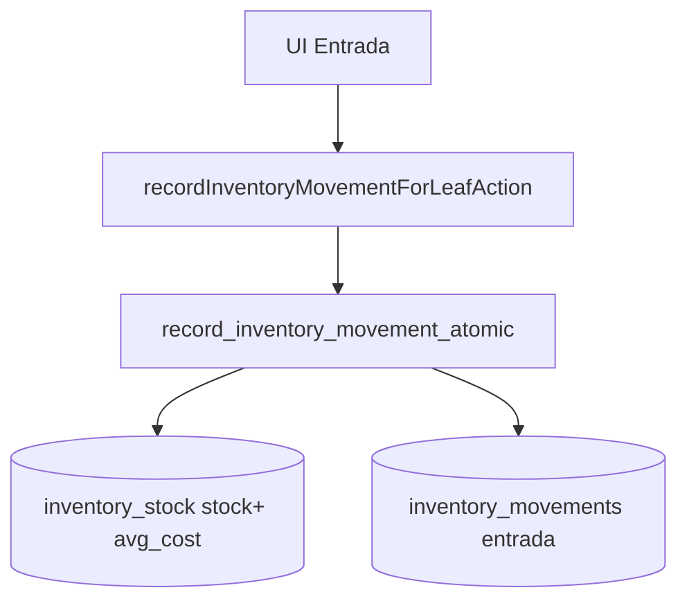
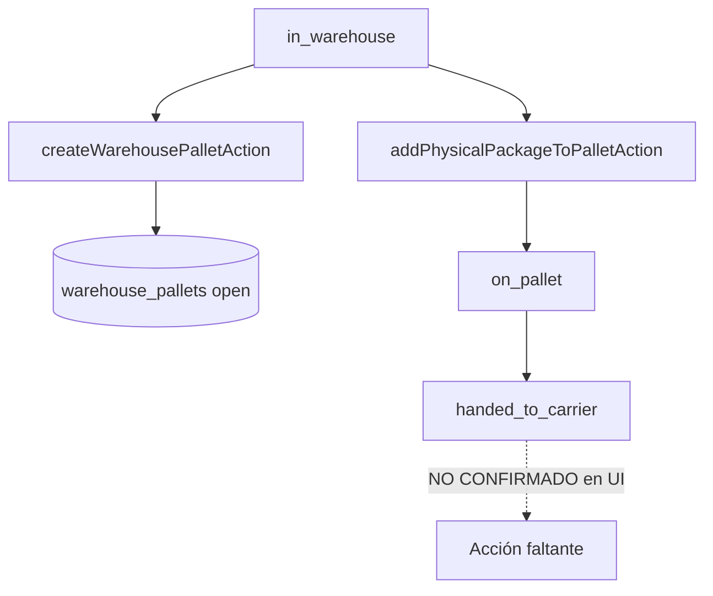
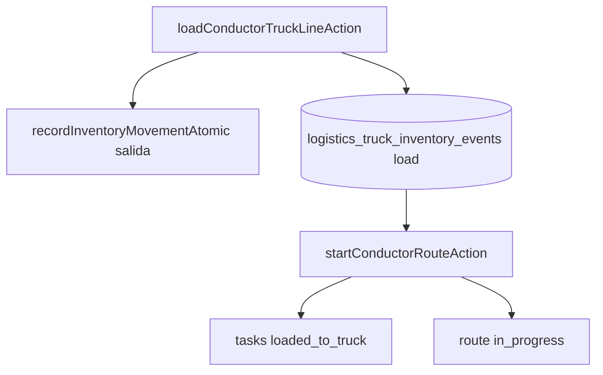
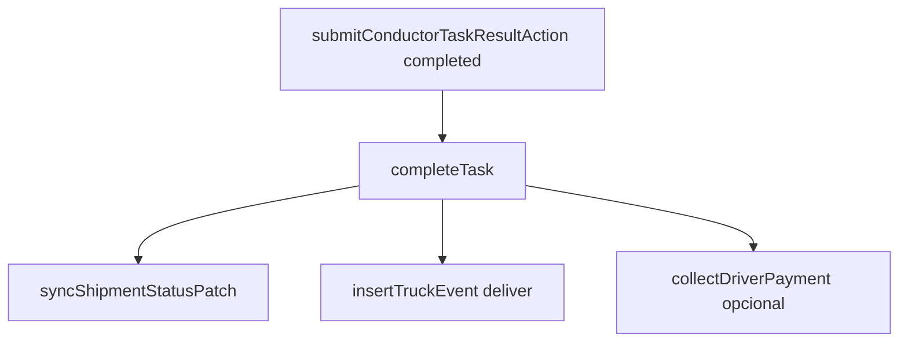
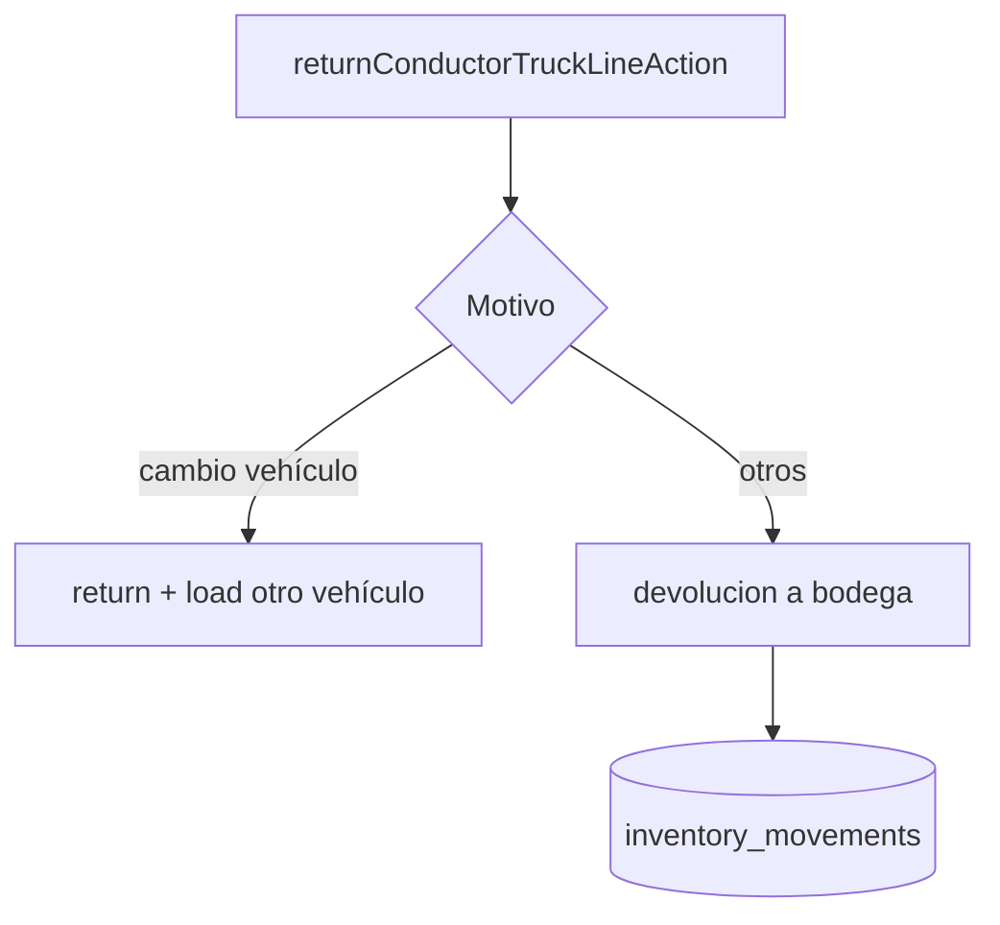
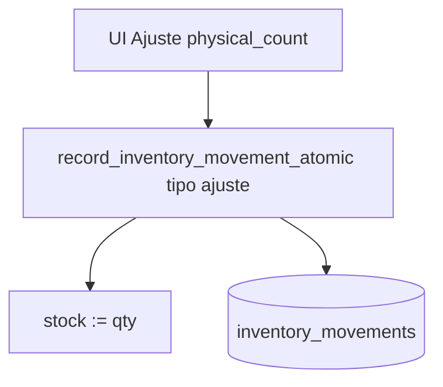
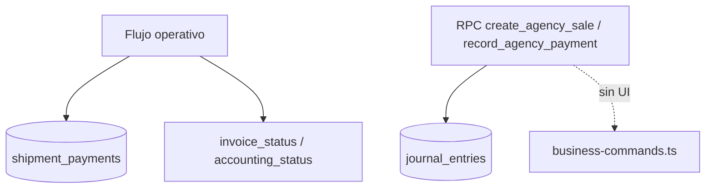
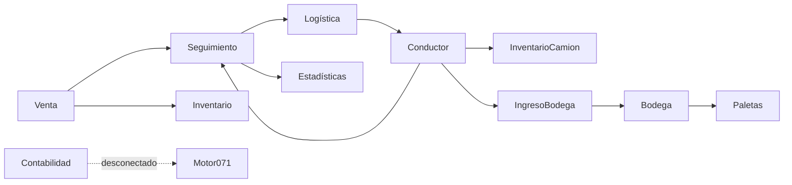

# Mapa funcional actual de Boxario

Documento generado por análisis de solo lectura del código real (sin modificar lógica, sin migraciones y sin inventar comportamiento).  
Fecha de análisis: **2026-07-27**.

Convenciones usadas en este documento:

- **Funcional:** hay UI + server action/RPC + tablas que respaldan el flujo.
- **Parcial:** existe parte del flujo, pero falta un eslabón (acción, estado o UI).
- **Prototipo:** backend o UI existen, pero no están conectados de extremo a extremo para uso diario.
- **Legacy:** código o tablas aún presentes, sustituidas o desplazadas por un modelo más nuevo.
- **Desconectado:** definido pero sin invocación desde pantallas activas.
- **NO CONFIRMADO:** no hubo evidencia concluyente en el código revisado.

---

## 1. Resumen ejecutivo

Boxario es un sistema operativo de **paquetería / envíos internacionales de cajas** para una empresa (organización cliente) y, opcionalmente, su red de agencias. No es un ERP genérico: el eje operativo es la **venta de envío** (`shipments`) y su ciclo físico (caja vacía → recolección de caja llena → bodega → paleta → proveedor).

**Quiénes lo usan (roles base en `src/lib/auth/role-catalog.ts`):**

| Rol | Slug | Uso principal |
|---|---|---|
| Administrador | `administrador` | Todo (`permission: all`) |
| Vendedor | `vendedor` | Nueva venta, clientes, seguimiento |
| Logística | `logistica` | Rutas, tareas, programación |
| Conductor | `conductor` | Tareas del día e inventario de camión |

Roles opcionales: `bodega`, `finanzas`, `auditor`, captadores/supervisores de agencias, `distribuidor` (legacy), `administrador_agencia` / `vendedor_agencia` (módulo agencia).

**Problema operativo que resuelve:** registrar una venta de envío, programar entrega de caja vacía y recolección de caja llena, ejecutar la ruta con conductor, recibir cajas en bodega, agruparlas en paletas, controlar stock de insumos/cajas vacías, cobrar y medir desempeño de vendedores.

**Módulos principales visibles en el menú** (`src/components/app-shell.tsx`):

1. **Envíos** — `/venta`, `/seguimiento`
2. **Stock** — `/inventario`
3. **Flujo de bodega** — `/ingreso-bodega`, `/bodega`, `/paletas`
4. **Operación** — `/logistica`, `/conductor/tareas`, `/conductor/inventario-camion`
5. **Dinero** — `/contabilidad`
6. **Reportes** — `/estadisticas`
7. **Admin** — `/configuracion` (+ `/platform` solo plataforma)

También existe sección **Agencias** (condicionado a `agencyModuleEnabled`).

**Flujo general venta → entrega (capa operativa activa):**

1. Vendedor crea venta en `/venta` → RPC `create_shipment_sale_atomic` inserta `shipments` + `shipment_packages` + `shipment_payments` (si hay pago) + `shipment_logistics_tasks` + reserva/descuento de `inventory_stock`.
2. El envío aparece en `/seguimiento`.
3. Logística confirma fecha/ruta (`confirmLogisticsTaskScheduleAction`) → crea/reutiliza `logistics_routes` + `logistics_route_stops`.
4. Conductor carga cajas vacías al camión (`logistics_truck_inventory_events`), inicia ruta y completa/falla tareas.
5. Tras recolección, las cajas físicas llegan a `/ingreso-bodega` → `/bodega` → `/paletas`.
6. Cobros viven en `shipment_payments` / `invoice_status`; métricas de vendedores leen `shipments`.

**Relación inventario / bodega / logística / contabilidad:**

- **Inventario (`/inventario`)** = stock agregado de SKUs (cajas vacías/insumos) por bodega (`inventory_*`).
- **Flujo de bodega** = custodia de **cajas llenas individuales** (`shipment_packages`), separado del stock agregado.
- **Logística** = tareas y rutas sobre `shipment_logistics_tasks`.
- **Contabilidad UI** = dashboard mínimo; el libro mayor (`journal_entries`, etc.) existe en SQL pero **no está alimentado desde la UI operativa**. El dinero real del flujo de ventas vive en `shipment_payments`.

**Encabezado `SCGS`:** no es un selector de tenant. Es el **acrónimo** de la organización activa (`organizations.settings.company_short_name`), resuelto por `resolveOrganizationBrandTitle` en `src/lib/organizations/branding.ts`. Cada usuario pertenece a **una** organización (`profiles.organization_id`); no hay cambio de contexto por cookie/header (confirmado por `src/lib/auth/platform-isolation.eval.test.ts`).

---

## 2. Mapa del menú y rutas

Fuente del menú: `src/components/app-shell.tsx` (`navSections`, `navItems`, `navItemsForSession` → `canAccessPath`).  
Gate de página: `requirePathAccess` en `src/lib/auth/require.ts`.  
Permisos de ruta: `PATH_PERMISSIONS` en `src/lib/auth/permissions.ts`.

| Sección | Opción | Ruta URL | Archivo principal | Permiso requerido (OR) | Estado |
|---|---|---|---|---|---|
| Envíos | Nueva venta | `/venta` | `src/app/venta/page.tsx` | `sales.manage` | Funcional |
| Envíos | Seguimiento y envíos | `/seguimiento` | `src/app/seguimiento/page.tsx` | `routes.view`, `sales.manage`, `sales.settings.manage`, `accounting.view`, `audit.immutable.view` | Funcional |
| Stock | Inventario | `/inventario` | `src/app/inventario/page.tsx` | `inventory.view` | Funcional |
| Flujo de bodega | Ingreso a bodega | `/ingreso-bodega` | `src/app/ingreso-bodega/page.tsx` | `warehouses.manage`, `sales.manage` | Funcional |
| Flujo de bodega | Bodega | `/bodega` | `src/app/bodega/page.tsx` | `warehouses.manage`, `sales.manage` | Funcional |
| Flujo de bodega | Paletas | `/paletas` | `src/app/paletas/page.tsx` | `warehouses.manage`, `sales.manage` | Parcial (falta cierre/entrega a carrier) |
| Operación | Logistica | `/logistica` | `src/app/logistica/page.tsx` | `routes.view`, `routes.update_status`, `logistics.settings.manage` | Funcional con hueco draft→planned |
| Operación | Tareas conductor / Mis tareas | `/conductor/tareas` | `src/app/conductor/tareas/page.tsx` | `routes.view` + identidad `conductor` o `all` | Funcional |
| Operación | Inventario camion | `/conductor/inventario-camion` | `src/app/conductor/inventario-camion/page.tsx` | igual `/conductor` | Funcional (sin UI de `adjust`) |
| Dinero | Contabilidad | `/contabilidad` | `src/app/contabilidad/page.tsx` | `agency.account.*`, `accounting.*`, `financial_hold.*` | Prototipo UI / motor SQL desconectado |
| Reportes | Estadisticas | `/estadisticas` | `src/app/estadisticas/page.tsx` | `audit.immutable.view` | Funcional (datos reales) |
| Admin | Configuracion | `/configuracion` | `src/app/configuracion/page.tsx` | `settings.manage`, `users.manage`, `warehouses.manage`, `permissions.manage`, `time_clock.*` | Funcional |
| Admin | Plataforma | `/platform` | `src/app/platform/page.tsx` | `session.isPlatformAdmin` | Funcional (staff Boxario) |

### Detalle por ítem del menú analizado

#### Nueva venta — `/venta`
- Layout: `src/app/venta/layout.tsx` + `requirePathAccess`
- Componentes: `VentaClient` (`src/components/venta-client.tsx`), `saleSteps` en `src/components/sale/venta-parts.tsx`, `SaleLogisticsStep`
- Hooks/bootstrap: `loadVentaBootstrap` (`src/lib/sale/bootstrap.ts`)
- Server actions: `createShipmentAction` (`src/app/actions/shipments.ts`)
- RPC: `create_shipment_sale_atomic` (`supabase/migrations/132_atomic_sales_tracking_and_authoritative_writes.sql`)
- Permiso: `sales.manage` (vendedor, administrador)
- Tablas: `shipments`, `shipment_packages`, `shipment_payments`, `shipment_logistics_tasks`, `inventory_stock`, `inventory_sale_reservations`, `inventory_movements`, `activity_history`, `security_audit_events`, `shipment_sale_operations`

#### Seguimiento y envíos — `/seguimiento`
- Componentes: `EnviosPageContent` → `EnviosClient`, `ShipmentJournalDialog`; configuración comercial en `Configuración → Ventas`
- Actions: `listShipmentsAction`, `updateShipmentLogisticsPlanAction`, `updateLogisticsTaskAction`, `finalizeShipmentInvoiceAction`, `shipment-journal.ts`, `confirmLogisticsTaskScheduleAction`
- Roles típicos: vendedor, logística, admin, finanzas/auditor (lectura según permiso)

#### Inventario — `/inventario`
- Componentes: `InventarioClient`, `InventoryStructureEditor`, `InventoryItemContextMenu`, `InventoryTrackingDrawer`
- Actions: `src/app/actions/inventory.ts`, `inventory-assignments.ts`, `inventory-transfers.ts`, `inventory-bins.ts`, `inventory-custody.ts`
- RPC: `record_inventory_movement_atomic` (migración `107_inventory_entry_costs.sql`)
- Permisos de acción: `inventory.view` / `adjust` / `reserve` / `assign` / `return`

#### Ingreso a bodega / Bodega / Paletas
- Components: `WarehouseIntakeClient`, `WarehouseClient`, `PalletsClient`
- Actions: `warehouse-intake.ts`, `physical-packages.ts`
- Tablas: `warehouse_intake_*`, `shipment_packages`, `warehouse_pallets`

#### Logística / Conductor
- Components: `LogisticaClient`, `ConductorTareasClient`, `ConductorTruckInventoryClient`, `LogisticsFleetAdminClient`
- Actions: `logistics-routes.ts`, `logistics-fleet.ts`, `conductor-tasks.ts`
- Subrutas sin menú: `/logistica/vehiculos`, `/logistica/conductores`

#### Contabilidad / Estadísticas / Configuración
- Contabilidad: `BusinessPage` surface `finance` → `BusinessCommandCenter` / `Finance()`
- Estadísticas: `EstadisticasClient` + `getSellerMetricsAction` / `getDistributionMetricsAction`
- Configuración: `ConfiguracionClient` (~2950 líneas), menú en `src/lib/config-menu-groups.ts`

### Rutas relevantes fuera del menú

| Ruta | Uso |
|---|---|
| `/`, `/login`, `/perfil` | Home, auth, perfil |
| `/rastrear` | Tracking público |
| `/reloj`, `/time-clock` | Reloj checador |
| `/seguimiento/excepciones` | Custodia y excepciones |
| `/agencia*`, `/agencias*`, `/captacion`, `/solicitudes` | Módulo agencias |
| `/distribuidor*`, `/mis-distribuidores`, `/vendedores*` | Distribución / comercial |
| `/auditoria` | Redirect a seguimiento |

---

## 3. Explicación funcional de cada pantalla

### 3.1 Nueva venta (`/venta`)

#### Propósito
Crear una venta/envío operativo: remitente, destinatario (si aplica), cajas, logística de entrega/recolección, pago inicial e invoice.

#### Usuario o rol
Vendedor (`sales.manage`) y Administrador.

#### Datos mostrados
Bootstrap: clientes, atajos, países/precios/promos, cargos logísticos sugeridos, sugerencias horarias, branding (`loadVentaBootstrap`).

#### Acciones disponibles
Pasos: Remitente → Destinatario → Caja → Logística → Final.  
Confirmación llama `createShipmentAction`.

#### Escrituras
`shipments`, `shipment_packages`, `shipment_payments` (si `paid > 0`), `shipment_logistics_tasks`, `inventory_stock` (+ `inventory_sale_reservations` o `inventory_movements`), `activity_history`, `security_audit_events`, `shipment_sale_operations`; bitácora si hay cargo logístico adicional.

#### Lecturas
`customers`, `customer_recipients`, `pricing_*`, `organization_route_settings`, catálogo de rutas/días, `warehouses`, `inventory_stock`.

#### Validaciones
- Frontend: completitud de pasos, dirección, país.
- Servidor: `authoritativeSaleQuote` (precio no confiable del cliente), `paid` ∈ [0, total], misma org para cliente/bodega.
- DB (RPC): permiso `sales.manage`/`all`, stock con `FOR UPDATE`, factura única, idempotencia.

#### Permisos
`sales.manage` (ruta + action + RPC).

#### Resultado
Un `shipment` con `code` (número de factura), packages, tareas logísticas y opcionalmente pago/reserva de stock. Token de tracking público (hash en DB).

#### Conexiones
Aparece en Seguimiento; tareas alimentan Logística/Conductor; stock afecta Inventario; cobros alimentan métricas y `invoice_status`.

#### Estado real
**Funcional.** Legacy `createShipmentActionLegacy` existe pero **no se exporta** y los triggers de la migración 132 rechazan escrituras directas autoritativas.

---

### 3.2 Seguimiento y envíos (`/seguimiento`)

#### Propósito
Operar el ciclo de vida del envío: estado, logística, cobro, bitácora, contactos, dueño de venta, configuración de ventas.

#### Usuario o rol
Ventas, Logística, Contabilidad/Auditoría (según permiso), Admin.

#### Datos mostrados
Lista de `ShipmentRow` con pagos, tasks, hitos, plan logístico, evidencia de cajas; miembros de ruta; dueños; catálogo de rutas.

#### Acciones disponibles
Cambiar estado (`updateShipmentStatusAction`), marcar recepción en oficina, editar plan logístico, reprogramar/reactivar tareas, confirmar disponibilidad/ruta, finalizar/cobrar factura, bitácora (`shipment-journal.ts`), contactos, sync de remitente/destinatario.

#### Escrituras
`shipments`, `shipment_logistics_tasks`, `shipment_payments`, `shipment_journal_entries`, `activity_history`, `logistics_routes`/`stops` (vía confirmación). Los contactos nuevos también escriben en `shipment_journal_entries`: `createShipmentContactLogAction` (`src/app/actions/shipments.ts:2014`) inserta en la bitácora con categoría `customer`, **no** en `shipment_contact_logs`.

#### Lecturas
Las anteriores más `shipment_contact_logs`, que solo se **lee** por compatibilidad histórica dentro del select de `listShipmentsAction` (`shipments.ts:405-408`); no se encontró ninguna escritura activa a esa tabla.

#### Validaciones
Estados `Pendiente…` no se asignan manualmente (`isPendingShipmentStatus`). Conductor solo puede mutar shipments asignados a él.

#### Permisos
Ruta amplia (OR). Acciones granulares: `sales.manage`, `routes.update_status`, overrides de bitácora por categoría.

#### Resultado
Envíos actualizados; tareas confirmadas; cobros; entradas de bitácora.

#### Conexiones
Fuente de verdad visible para Logística y Conductor; revalidate cruzado desde conductor.

#### Estado real
**Funcional.** Subruta `/seguimiento/excepciones` es módulo de custodia/excepciones separado.

---

### 3.3 Inventario (`/inventario`)

#### Propósito
Gestionar stock agregado de ítems por bodega: entradas, salidas, ajustes, costos, asignaciones, transferencias, ubicaciones (bins), panel de custodia resumen.

#### Usuario o rol
Admin; vendedor (ver/reservar); rol opcional `bodega`.

#### Datos mostrados
Árbol categorías/ítems, stock (`stock/reserved/assigned/unavailable`), historial, asignaciones, transferencias, bins, panel “Dónde están” (mezcla visual con conteos de `shipment_packages`).

#### Acciones
Entrada / Salida / Ajuste; foto; unidad; tags proveedor; asignar/cerrar a empleado; transferir bodega; colocar en bin.

#### Escrituras
`inventory_items`, `inventory_stock`, `inventory_movements` (append-only), `inventory_assignments`, `inventory_warehouse_transfers`, `inventory_bin_stock`, `warehouse_bins`.

#### Validaciones
Motivos por tipo (`src/lib/inventory-movement-audit.ts`); RPC valida qty, permiso, stock insuficiente; bins no pueden superar stock (validación app).

#### Permisos
Ruta: `inventory.view`. Mutaciones: `inventory.adjust` / `reserve` / `assign` / `return`.

#### Resultado
Stock actualizado + movimiento auditable. Entradas pueden actualizar `avg_cost`.

#### Conexiones
Ventas reservan/descuentan stock; conductor carga camión descuenta stock; panel custodia solo lectura junto a cajas físicas.

#### Estado real
**Funcional.** COGS de venta (margen por `avg_cost` en salidas) **no visible en UI** — **parcial a nivel de reporte**.

---

### 3.4 Ingreso a bodega (`/ingreso-bodega`)

#### Propósito
Descargar y recepcionar cajas físicas de clientes que llegan en camión (o “encontradas”), con escaneo, peso, condición y conciliación.

#### Usuario o rol
Quien tenga `warehouses.manage` o `sales.manage` (típicamente bodega/admin/ventas).

#### Datos / acciones
Workspace + camiones llegados; abrir sesión; escanear; cerrar/reabrir (reabrir exige `settings.manage`).

#### Escrituras
`warehouse_intake_sessions/items/events/expected_packages`; actualiza `shipment_packages`; puede crear `operational_exceptions`.

#### Lecturas
`shipment_packages`, rutas/llegadas de camión.

#### Validaciones
Sesión abierta; no re-escaneo; peso > 0; evidencia si condición ≠ correct o peso fuera de tolerancia; confirmaciones al cierre.

#### Resultado
Cajas en `warehouse_intake` (o cuarentena); sesión `completed` / `completed_with_exceptions`.

#### Conexiones
Prepara `/bodega`. **No toca `inventory_stock`.**

#### Estado real
**Funcional.**

---

### 3.5 Bodega (`/bodega`)

#### Propósito
Mover cajas de ingreso a “en bodega” y revisar contenido/proveedor internacional / diferencias de peso.

#### Acciones
`movePhysicalPackageToWarehouseAction`, `updatePhysicalPackageReviewAction`, `reviewPhysicalPackageWeightDifferenceAction` (`settings.manage`).

#### Estado real
**Funcional.** Muestra `shipment_packages`, no stock de inventario ni bins de inventario.

---

### 3.6 Paletas (`/paletas`)

#### Propósito
Agrupar cajas `in_warehouse` en `warehouse_pallets` por país.

#### Acciones
Crear paleta; añadir caja (`addPhysicalPackageToPalletAction`).

#### Validaciones
Caja en bodega; paleta `open`; mismo país.

#### Estado real
**Parcial:** no se encontró server action de **cerrar** paleta ni de pasar a `handed_to_carrier` desde estas pantallas. El estado existe en el enum/modelo.

---

### 3.7 Logística (`/logistica`)

#### Propósito
Planificar rutas del día: catálogo semanal, plantillas/subrutas, confirmar tareas, asignar conductor/vehículo, ordenar paradas, flota (subpáginas), solicitudes de agencia si el módulo está activo.

#### Usuario
Logística (`routes.*`, `logistics.settings.manage`); Admin.  
UI `canManageRoutes` en página = solo `routes.update_status` (`src/app/logistica/page.tsx:54`).  
Server `canManageRoutes` en `logistics-routes.ts` = `routes.update_status` **o** `sales.manage`.

#### Datos
Shipments/tasks, routes, catalog weekdays/templates, warehouses, members, agency panel opcional.

#### Escrituras
`logistics_routes` (insert `draft`), `logistics_route_stops`, `logistics_route_templates`, `logistics_weekday_defaults`, updates de `shipment_logistics_tasks`, `agency_visits` vía RPC.

#### Estado real
**Funcional:** Logística crea `draft`, publica a `planned` (`publishLogisticsRouteAction` / RPC `publish_logistics_route`), el conductor ve solo `planned`/`in_progress` y arranca con GPS. `warehouse_id` es opcional.

---

### 3.8 Tareas conductor (`/conductor/tareas`)

#### Propósito
Ejecutar entregas/recolecciones del día: completar/fallar con evidencia, cobro de depósito, invoice visible.

#### Usuario
Conductor. Admin puede previsualizar (`canPreviewConductorTasks` solo si `roleSlug === "administrador"`). Label: “Mis tareas” vs “Tareas conductor”.

#### Acciones
`submitConductorTaskResultAction`, reactivar, etc. (`conductor-tasks.ts`).

#### Resultado
Task completed/cancelled; hitos de shipment; truck events; posible cobro vía `collect_shipment_invoice_payment`; stop outcome.

#### Estado real
**Funcional**, condicionado a que la ruta esté `planned`/`in_progress`.

---

### 3.9 Inventario camión (`/conductor/inventario-camion`)

#### Propósito
Cargar cajas vacías al vehículo, ver faltantes, iniciar ruta, devolver sobrantes/daños, cargo de cajas llenas.

#### Acciones
`loadConductorTruckLineAction`, `returnConductorTruckLineAction`, `startConductorRouteAction`, `completeConductorRouteArrivalAction`.

#### Eventos
`logistics_truck_inventory_events`: `load|deliver|return|adjust|collect_full_box|unload_full_box`.  
`adjust` está en el modelo/cálculo; **sin action de UI** que lo inserte.

#### Estado real
**Funcional** para load/deliver/return; **parcial** en `adjust`.

---

### 3.10 Contabilidad (`/contabilidad`)

#### Propósito (UI real)
Dashboard de solo lectura (`Finance` en `business-command-center.tsx`): métricas y holds si `agencyModuleEnabled`; si no, dos cards + empty state fijo.

#### Usuario
Quien tenga permisos `accounting.*` / `agency.account.*` / `financial_hold.*` (rol opcional `finanzas`, admin).

#### Escrituras desde esta pantalla
**Ninguna.** Las actions de `business-commands.ts` (`createAgencySaleAction`, `recordAgencyPaymentAction`, etc.) **no son importadas por ningún `.tsx`**.

#### Estado real
**Prototipo / desconectado de UI.** Motor SQL `071_agency_finance_accounting.sql` completo; contabilidad operativa del día a día = `shipment_payments` + flags de invoice.

---

### 3.11 Estadísticas (`/estadisticas`)

#### Propósito
Métricas de vendedores y de distribuidores legacy.

#### Datos
- Vendedores: `shipments` reales (`seller-metrics`).
- Distribuidores: `distribution_partners` + ledger + shipments (`distribution/metrics.ts`).

#### Estado real
**Funcional con datos reales.** Posible gap: ruta exige `audit.immutable.view` pero acciones exigen `canManageAllShipments` / `settings.manage`.

---

### 3.12 Configuración (`/configuracion`)

#### Propósito
Organización, usuarios, roles, bodegas, precios, costos operativos, time clock, apariencia local.

#### Estado real
**Funcional** en secciones activas. `deliveries` es código residual (redirige a Seguimiento). `distributors` diferido (URL directa).

---

## 4. Flujo completo de una venta

### Flujo A — Venta operativa matriz/org (activo, `/venta`)

1. **Comienza** en `/venta` (`VentaPage` → `VentaClient`).
2. **Formulario** multi-paso `saleSteps`: client → recipient → box → delivery → finish.
3. **Datos:** remitente, destinatario (si `full`), país/cajas/promos, modos logísticos empty/full, ventanas horarias, decisión de ruta, cargos adicionales, pago.
4. **Procesa:** `createShipmentAction` → `authoritativeSaleQuote` → `atomicSaleInventoryCommand` → RPC `create_shipment_sale_atomic`.
5. **Tablas:** ver sección 3.1.
6. **Factura:** no hay tabla `invoices`; el `shipment.code` + `invoice_status`/`accounting_status`/`finalized_at` **son** la factura.
7. **Pagos:** `shipment_payments` si `paidCents > 0`; saldo posterior vía `finalizeShipmentInvoiceAction` / `collect_shipment_invoice_payment` (también desde conductor).
8. **Inventario:**  
   - reserva si entrega empty por chofer (`inventory_sale_reservations` + `reserved`);  
   - deduct inmediato si handoff mostrador (`inventory_movements` salida `sale_counter_handoff`);  
   - si falla stock, venta puede continuar con warning (`mode: "skip"`) — documentado en análisis de `atomicSaleInventoryCommand`.
9. **Envío:** el propio `shipments` + `shipment_packages` + tasks.
10. **Seguimiento:** `listShipmentsAction` lo lista de inmediato.
11. **Logística:** confirma schedule → `logistics_routes` draft + stops.
12. **Ruta:** stops ordenados; asignación conductor/vehículo (solo en `draft` para cambios de conductor/vehículo).
13. **Conductor:** ve tareas del scope date; completa/falla.
14. **Entrega/recolección:** `submitConductorTaskResultAction` → `completeTask`/`failTask` → sync status shipment; falla → reprogramar con Logística.
15. **Contabilidad/Estadísticas:** cobro actualiza `paid`/`invoice_status`/`accounting_status`; estadísticas de vendedores leen shipments pagados; **no** genera `journal_entries` del motor 071.

`sale_kind`:
- `full` — con destinatario (flujo completo típico).
- `empty_box_deposit` — depósito de caja vacía sin destinatario aún.

### Flujo B — Legacy createShipment (inerte)

`createShipmentActionLegacy` en `shipments.ts`: no exportado; triggers 132 bloquean escrituras autoritativas directas. **No es flujo activo.**

### Flujo C — Venta de agencia / motor `sales` v1

Existe RPC/action `create_agency_sale` / `createAgencySaleAction` y tablas `sales`/`customer_invoices`/`agency_charges`. **Ningún componente UI las invoca.**  
`/agencia` usa `BusinessPage` surface agency (métricas/workspace), no el mismo `VentaClient`.  
**NO CONFIRMADO** un flujo UI completo de “nueva venta de agencia” equivalente a `/venta` en esta exploración.

### Flujo D — Distribuidor legacy

`distribution_partners` + RPC de distribución (`distribution.ts`). Rutas `/distribuidor`, `/distribuidores`, `/mis-distribuidores` **fuera del menú principal**; métricas en Estadísticas tab Distribuidores. Paralelo a `agencies` (con `legacy_distribution_partner_id`).

### Varios flujos ≠ uno solo

No combinar: (A) venta operativa `shipments`, (C) motor contable/agencia `sales`, (D) distribuidores legacy.

---

## 5. Flujo completo de inventario

Alcance: **Sistema A** (`inventory_*`). Independiente del flujo de cajas físicas.

| # | Tema | Implementación confirmada |
|---|---|---|
| 1 | Producto/tipo caja | `inventory_items` + categorías; precios de venta en `pricing_country_boxes` (catálogo comercial separado) |
| 2 | Entrada | Formulario Entrada → `recordInventoryMovementForLeafAction` → `record_inventory_movement_atomic` tipo `entrada` |
| 3 | Compra proveedor | Evidencia `supplierName` en movimiento; tags reutilizables desde historial (sin tabla proveedores) |
| 4 | Costo pieza/lote | Captura en entrada; calcula complemento; actualiza `avg_cost` ponderado |
| 5 | Proveedor | Por movimiento, no por stock acumulado |
| 6 | Inventario inicial | Entrada manual o seed; no hay comando especial “inventario inicial” |
| 7 | Transferencias | `inventory_warehouse_transfers` + motivos `warehouse_transfer_*` |
| 8 | Devoluciones | Al cerrar asignación (`devolucion`) o return de camión a bodega |
| 9 | Ajustes | Tipo `ajuste` fija stock absoluto |
| 10 | Conteo físico | Motivo `physical_count` solo en Ajuste |
| 11 | Daño | Motivo salida `assignment_damage` o cierre de asignación `dano` |
| 12 | Pérdida | `assignment_loss` / `perdida` |
| 13 | Consumo interno | `assignment_consume` / `consumo` |
| 14 | Asignación a venta | `inventory_sale_reservations` + fulfill/release |
| 15 | Agencia | `reason_code = agency_delivery` (oculto si módulo off) |
| 16 | Traslado a bodega (bins) | `inventory_bin_stock` — etiqueta secundaria, **sin ledger de movimiento** |
| 17 | Paleta | **No aplica** a inventory_items |
| 18 | Camión | `load` descuenta stock bodega (`salida`) |
| 19 | Entrega cliente | `deliver` solo baja del camión (stock ya salió en load) |
| 20 | Devolución/sobrante | `return` camión → `devolucion` a bodega (salvo cambio de vehículo) |

### Matriz de movimientos manuales

| Tipo UI | Motivos (`InventoryMovementReasonCode`) | Cantidad | Tabla |
|---|---|---|---|
| Entrada | `manual_entry`, `other` | +qty | `inventory_movements` + ↑`stock` |
| Salida | `manual_exit`, `assignment_damage`, `assignment_loss`, `assignment_consume`, `other` | −qty | idem ↓`stock` |
| Ajuste | `physical_count`, `other` | set absolute | stock := qty |

`INVENTORY_MOVEMENT_COMMAND_REQUIRED`: excepción del trigger `guard_inventory_stock_direct_write` (migración 132) contra updates directos de balances desde rol `authenticated`. Los RPC `security definer` (`record_inventory_movement_atomic`, asignaciones, etc.) deben poder actualizar stock: migración 148 agrega bypass por `current_user in ('postgres','supabase_admin')` (mismo patrón que perfiles en 134).

**Efecto contable:** costos en movimiento/entrada y `avg_cost` — **solo operativo**; no postean `journal_entries`.

**Separación de motivos:** sí, filtrados por tipo en UI (`manualMovementReasonCodesByType`). Motivos automáticos no aparecen en selectores manuales.

---

## 6. Diferencia entre Inventario, Ingreso a bodega, Bodega y Paletas

| Pregunta | Respuesta con evidencia |
|---|---|
| ¿Inventario = propiedad/existencia/ubicación? | **Existencia agregada** por bodega+ítem. Bins = ubicación opcional no autoritativa. Sin modelo de “propiedad legal”. |
| ¿Ingreso = descarga/recepción/conteo? | **Descarga + recepción + verificación** caja a caja de `shipment_packages`. |
| ¿Bodega muestra qué? | **Cajas recibidas** (`warehouse_intake` / `in_warehouse`), no stock SKU ni bins de inventario. |
| ¿Paletas agrupa unidades físicas? | **Sí**, `shipment_packages` → `warehouse_pallets` por país. |
| ¿Entrada inventario crea recepción bodega? | **No.** |
| ¿Recepción bodega aumenta inventario? | **No.** |
| ¿Inventario sin ingreso físico? | **Sí** (compra/insumos locales vía Entrada). |
| ¿Caja en inventario y paleta? | Son entidades distintas; una `shipment_package` no puede estar en dos status a la vez. |
| ¿Doble conteo? | Evitado **dentro** de cada sistema (locks/estado/idempotencia). Entre sistemas **no se suman** en transacciones. |
| ¿ID conector? | **No hay FK** entre `inventory_items` y `shipment_packages`. Puente visual: `inventory-custody.ts`. |

### Diagrama textual del flujo real

```
=== SISTEMA A: stock de cajas vacías / insumos ===
Compra / Entrada manual
  ↓
record_inventory_movement_atomic → inventory_stock (+ avg_cost)
  ↓
(reserva en venta | asignación empleado | transferencia | load a camión)
  ↓
deliver al cliente (evento camión) / fulfill reserva

=== SISTEMA B: cajas llenas de clientes ===
Venta crea shipment_packages (awaiting_full_box)
  ↓
Conductor recolecta (in_truck / collect_full_box)
  ↓
Llegada de ruta → Ingreso a bodega (scan) → warehouse_intake
  ↓
Bodega (move) → in_warehouse
  ↓
Paletas → on_pallet
  ↓
handed_to_carrier  ← transición de escritura NO encontrada en UI de paletas
```

---

## 7. Logística, rutas y conductor

### Creación de rutas
1. Activar día (`set_logistics_route_weekday_enabled` / weekday defaults) → ruta implícita del día (LOG-008).
2. Opcional: subrutas `logistics_route_templates`.
3. Ruta operativa `logistics_routes` se crea **lazy** al confirmar/asignar tarea (`status: "draft"`).

### Qué se agrega
- Stops → `logistics_route_stops` (1:1 con `shipment_logistics_tasks`).
- Agency visits → tabla `agency_visits` (no stops), si módulo agencia.

### Conductor / vehículo
`assignLogisticsRouteDriverAction`, `assignLogisticsRouteVehicleAction` (solo `draft`). Flota en `/logistica/conductores|vehiculos` **solo administrador** (`canManageFleet`).

### Tareas conductor vs Logística
| | Logística | Tareas conductor |
|---|---|---|
| Objetivo | Planificar | Ejecutar |
| Alcance | Org completa | Conductor efectivo del día |
| Quién | logística/admin | conductor (+ admin preview) |

### Inventario camión
Load sale de bodega; deliver baja del camión; return regresa (o traspasa vehículo).  
Inventario deja bodega en el **load**. Conductor “recibe” en ese mismo evento (no hay handoff formal separado).

### Sobrantes / fallas / daños
- Falla de tarea: motivos `CONDUCTOR_TASK_FAILURE_REASONS` → task cancelled + attempt.
- Sobrante/daño en camión: return reasons (operativo inventario), **no** crea automáticamente `operational_exceptions`.
- Excepciones formales: `/seguimiento/excepciones` + `report_operational_exception`.

### Custodia
`package_custody_events` / handoffs — UI en excepciones/bodega; **NO CONFIRMADO** que conductor inserte eventos directamente desde TS (posible efecto lateral en RPC SQL no auditado línea a línea).

### Hueco draft → planned
**P0:** sin “enviar ruta” implementado en app; conductor no puede `startConductorRouteAction` sobre rutas creadas por la UI (quedan en `draft`).

---

## 8. Seguimiento y envíos

- **Entidades:** principalmente `shipments` (venta+envío) con packages, payments, tasks, journal, contactos.
- **Estados shipment:** `Pendiente entrega caja vacía`, `Pendiente recolección caja llena`, `En oficina`, `Pickup`, `Enviado`, `Entregado` (texto libre sin CHECK enum).
- **Tasks:** `pending|scheduled|assigned|loaded_to_truck|completed|cancelled`.
- **Disponibilidad cliente / reprogramación:** plan logístico + `confirmLogisticsTaskScheduleAction` + update/reactivate task.
- **Ruta:** confirmación crea/enlaza stops.
- **Bitácora:** `shipment_journal_entries` + eventos `activity_history` (SEG-001).
- **Vendedor:** dueño `sales_owner_id`; puede gestionar ventas/cobros/bitácora según permiso.
- **Desde Logística:** programación y rutas.
- **Desde Conductor:** resultados de tarea, evidencia, cobros, fallas → revalidate `/seguimiento`.

---

## 9. Contabilidad

### Qué registra hoy de forma operativa (sí usado)

| Concepto | Dónde |
|---|---|
| Ventas/envíos | `shipments` |
| “Factura” | columnas de `shipments` + contadores |
| Pagos | `shipment_payments` |
| Exportabilidad contable simple | `accounting_status` exportable/not_exportable |
| Cobro conductor | vía `collect_shipment_invoice_payment` |

### Qué existe en SQL pero UI no alimenta

Ventas v1 `sales`, `customer_invoices`, `customer_payments`, `agency_charges/payments`, `journal_entries/lines`, `driver_cash_custody_events`, `driver_settlements`, `financial_holds` (dashboard puede leer holds/métricas en 0).

### Automático vs manual
- Automático en flujo real: pagos al crear venta / finalizar / cobro conductor; flags de invoice.
- Manual en motor 071: actions existen sin botones.
- Inventario: costos operativos **sin** asiento contable.

### Cierres
`/agencia/cierre` (fuera del menú Dinero) — cierre diario de agencia funcional a nivel controlled-operations; mezcla datos reales de shipments/excepciones con tablas financieras posiblemente vacías.

---

## 10. Estadísticas

| Tab | Fuente | Real/mock | Filtros |
|---|---|---|---|
| Vendedores | `shipments` + profiles | **Real** | day/week/month/range |
| Distribuidores | `distribution_partners` + ledger + shipments | **Real (legacy)** | similar |

Métricas vendedores: ventas, abiertas/cerradas (`invoice_status`), cobrado, profit, ticket, participación, desglose diario.  
**No** hay métricas de inventario/rutas/márgenes COGS en esta pantalla.  
Vistas legacy `?view=auditoria|inventario` redirigen fuera.

---

## 11. Configuración

| Configuración | Dónde se guarda | Quién puede cambiarla | Módulos que la utilizan |
|---|---|---|---|
| Nombre / acrónimo (`company_short_name` / SCGS) / teléfono | `organizations.settings` | `settings.manage` | Sidebar branding, sesión |
| Logo | Storage + org | `settings.manage` | Shell |
| Usuarios / acceso bodega | `profiles`, memberships | `users.manage` | Auth, scoping |
| Roles y permisos | `roles`, `role_permissions` | `permissions.manage` | Toda la app |
| Bodegas / bins | `warehouses`, `warehouse_bins` | `warehouses.manage` | Inventario, venta, logística |
| Precios/promos/tiempos por país | pricing config / `savePricingConfigAction` | `sales.manage` | `/venta` |
| Costos operativos conductor + lead time | `organization_route_settings` vía `save_logistics_axis_settings_v3` | `logistics.settings.manage` / `settings.manage` | Venta, logística |
| Depósito mínimo / pending | `organization_route_settings` vía sales axis | `sales.settings.manage` | Configuración → Ventas → Depósito + flujo de venta |
| Días/horarios de ruta | `logistics_weekday_defaults`, `logistics_route_templates` | `routes.update_status` | Configuración → Ventas → Rutas; Logística consume |
| Servicios comerciales por país | `country_commercial_service_settings` | comercial (módulo agencia) | Agencias/vendedores |
| Apariencia UI | `localStorage` | usuario local | Preferencias visuales |
| Time clock | tablas time_clock_* | `time_clock.manage` | `/reloj` |
| Plan limits (max users/warehouses/agencies) | `organizations.settings` | **NO CONFIRMADO** en UI cliente (protegido por plataforma, mig 126) | Entitlements |
| `agencyModuleEnabled` | settings matriz | **NO CONFIRMADO** toggle en `/configuracion` | Menú agencias, contabilidad, permisos agency.* |

---

## 12. Modelo de datos

### Tenancy y org

| Tabla | Propósito | PK | Relación clave |
|---|---|---|---|
| `business_tenants` | Tenant multi-empresa | `id` | matriz + agencias |
| `organizations` | Empresa operativa (matrix/agency) | `id` | `tenant_id`, `organization_type` |
| `organization_memberships` | Membresía v1 | `id` | user↔org |
| `profiles` | Usuario app (activo en sesión) | `id` = auth.users | `organization_id`, `role_id` |
| `agencies` | Agencia de negocio | `id` | `organization_id`, `legacy_distribution_partner_id` |

### RBAC
`roles`, `permissions`, `role_permissions`, `platform_admins`.

### Operativo ventas/envíos
`customers`, `customer_recipients`, `shipments`, `shipment_payments`, `shipment_packages`, `shipment_logistics_tasks`, `shipment_logistics_task_attempts`, `shipment_journal_entries`, `shipment_contact_logs` (legacy, solo lectura), `activity_history`, `shipment_sale_operations`.

### Inventario
`inventory_categories`, `inventory_items`, `inventory_stock`, `inventory_movements`, `inventory_assignments`, `inventory_sale_reservations`, `inventory_warehouse_transfers`, `inventory_bin_stock`, `warehouses`, `warehouse_bins`, `profile_warehouses`.

### Bodega física
`warehouse_intake_sessions`, `warehouse_intake_expected_packages`, `warehouse_intake_items`, `warehouse_intake_events`, `warehouse_pallets`, `package_custody_events`, `package_custody_handoffs`, `operational_exceptions`.

### Logística
`logistics_routes`, `logistics_route_stops`, `logistics_route_templates`, `logistics_weekday_defaults`, `logistics_vehicles`, `logistics_truck_inventory_events`, `organization_route_settings`.

### Pricing
`pricing_countries`, `pricing_country_boxes`, `pricing_promotions`, `country_commercial_service_settings`, `commercial_*`.

### Finanzas v1 (poco usadas en UI)
`sales`, `sale_lines`, `customer_invoices`, `customer_payments`, `agency_charges`, `agency_payments`, `gl_accounts`, `accounting_periods`, `journal_entries`, `journal_lines`, `driver_cash_custody_events`, `driver_settlements`, `financial_holds`, `immutable_audit_events`.

### Distribución legacy
`distribution_partners`, `distribution_partner_ledger`, offers, owner history.

### Time clock
`time_clock_*`.

**No existen** con esos nombres: `tenants`, `orders`, `products`, `boxes`, `invoices` (operativo), `warehouse_receipts`, `driver_tasks`, `truck_inventory` (tabla; el nombre real es `logistics_truck_inventory_events`).

---

## 13. Permisos y roles

### Matriz (acciones reales del menú analizado)

Leyenda: ✓ = sí vía catálogo base / `all`; ○ = posible si se asigna permiso; ✗ = no.

| Acción | Permiso | Admin matriz (`administrador`) | Admin agencia | Vendedor | Logística | Conductor |
|---|---|:---:|:---:|:---:|:---:|:---:|
| Nueva venta | `sales.manage` | ✓ | ○* | ✓ | ✗ | ✗ |
| Ver seguimiento | varios OR | ✓ | ○ | ✓ | ✓ (`routes.view`) | ✗ (ruta bloqueada) |
| Inventario ver | `inventory.view` | ✓ | ○ | ✓ | ✗ | ✗ |
| Inventario ajustar | `inventory.adjust` | ✓ | ○ | ✗ | ✗ | ✗ |
| Ingreso/Bodega/Paletas | `warehouses.manage` o `sales.manage` | ✓ | ○ | ✓ | ✗ | ✗ |
| Ver logística | `routes.view`… | ✓ | ○ | ✗ | ✓ | ✗ |
| Gestionar rutas (UI página) | `routes.update_status` | ✓ | ○ | ✗ | ✓ | ✓ permiso pero sin acceso a `/logistica` |
| Confirmar ruta (server) | `routes.update_status` **o** `sales.manage` | ✓ | ○ | ✓ (action) | ✓ | ○ |
| Tareas conductor | `routes.view` + identidad | ✓ (preview) | ✗ | ✗ | ✗ (path bloquea) | ✓ |
| Contabilidad UI | `accounting.*` / agency.account.* | ✓ | ○ | ✗ | ✗ | ✗ |
| Estadísticas ruta | `audit.immutable.view` | ✓ | ○ | ✗ | ✗ | ✗ |
| Configuración | settings/users/warehouses/permissions/time_clock | ✓ | ○ | ✗ | parcial (logistics settings) | ✗ |
| Flota vehículos/conductores | hardcode `roleSlug === administrador` | ✓ | ✗ | ✗ | ✗ | ✗ |

\* Admin agencia (`administrador_agencia`) vive en org tipo `agency` con plantilla SQL distinta; no es el rol base `administrador` de matriz.

### Discrepancias detectadas

1. **Server `canManageRoutes` incluye `sales.manage`; UI `/logistica` solo pasa `routes.update_status`.** Vendedor no entra a `/logistica`, pero sí puede confirmar schedules desde Seguimiento/actions.
2. **`/conductor*`:** menú filtrado por `canAccessPath`; solo `conductor` o quien tenga `all`. Logística **no** ve esas pantallas aunque tenga `routes.view`.
3. **`/estadisticas`:** entra con `audit.immutable.view`; datos exigen otros permisos → posible página vacía/FORBIDDEN.
4. **`listWarehousePalletsAction`:** listado sin el mismo `canOperateWarehouse` que otras mutaciones — posible lectura más permisiva (**NO CONFIRMADO** si intencional).
5. Menú y `requirePathAccess` usan la **misma** `canAccessPath` → consistente en gating de navegación.

### RLS
Funciones `user_has_permission`, `current_membership_has_permission`, `tenant_organization_access`; escrituras de negocio v1 vía security definer; triggers anti-delete en auditoría; guards 132 en shipments/inventory.

---

## 14. Dependencias entre módulos

| Módulo origen | Evento | Módulo destino | Resultado |
|---|---|---|---|
| Config / Logística Rutas | Día/horario activado | Nueva venta | Ofrece días/rangos reales (LOG-001/008) |
| Nueva venta | Venta confirmada | Seguimiento | Aparece shipment |
| Nueva venta | Tasks creadas | Logística | Tareas pendientes/programadas |
| Nueva venta | Reserva/deduct | Inventario | `reserved` o `stock` cambia |
| Seguimiento | Confirmar schedule | Logística/Rutas | `logistics_routes` + stops |
| Logística | Asignar conductor | Conductor | Tareas del día |
| Inventario camión | Load | Inventario | Salida de stock bodega |
| Conductor | Completar entrega empty | Inventario camión | Evento `deliver` |
| Conductor | Recolectar full | Ingreso a bodega | Caja en camión para intake |
| Conductor | Cobro | Seguimiento/pagos | `shipment_payments` / invoice |
| Conductor | Falla | Seguimiento/Logística | Reprogramar |
| Ingreso a bodega | Scan/cierre | Bodega | Packages `warehouse_intake` |
| Bodega | Mover | Paletas | Packages `in_warehouse` |
| Paletas | Añadir caja | (carrier) | `on_pallet` — cierre carrier incompleto |
| Cobros shipment | Invoice paid | Estadísticas | Métricas vendedor |
| Motor 071 | (sin UI) | Contabilidad | Asientos — **no disparado** |

---

## 15. Diagramas de flujo

### 1. Venta completa

```mermaid
flowchart TD
  A[/venta VentaClient] --> B[createShipmentAction]
  B --> C[authoritativeSaleQuote]
  C --> D[create_shipment_sale_atomic]
  D --> E[(shipments)]
  D --> F[(shipment_packages)]
  D --> G[(shipment_logistics_tasks)]
  D --> H[(shipment_payments)]
  D --> I[(inventory_stock)]
  E --> J[/seguimiento]
  G --> K[/logistica]
  K --> L[/conductor/tareas]
  L --> M{Resultado}
  M -->|ok| N[Hitos + posible cobro]
  M -->|fail| O[Reprogramar Logística]
```

### 2. Entrada de inventario



### 3. Flujo de bodega

```mermaid
flowchart TD
  A[Camión llega] --> B[open_warehouse_intake]
  B --> C[scan_warehouse_intake_package]
  C --> D[(warehouse_intake_items)]
  C --> E[shipment_packages warehouse_intake]
  D --> F[close_warehouse_intake]
  E --> G[/bodega move]
  G --> H[in_warehouse]
```

### 4. Carga de paleta



### 5. Carga de camión



### 6. Entrega



### 7. Devolución



### 8. Ajuste de inventario



### 9. Movimiento contable



### 10. Relación entre módulos



---

## 16. Problemas y contradicciones encontradas

### P0 — Bloquea operación o puede corromper datos

1. ~~**Rutas nunca pasan a `planned` desde la app**~~ **Resuelto 2026-08-02** con `publish_logistics_route` / `publishLogisticsRouteAction`.  
2. **Dos sistemas de inventario sin vínculo transaccional**  
   - Stock SKU vs cajas físicas independientes. No es corrupción per se, pero facilita decisiones operativas contradictorias (vender/reservar sin relación a packages).  
   - **Archivos:** `inventory_*` vs `shipment_packages` / `warehouse_intake_*`.

### P1 — Flujo importante incompleto o inconsistente

1. **Paletas sin cierre / `handed_to_carrier` desde UI** — flujo internacional incompleto.  
2. **Contabilidad UI no alimenta el libro mayor** — usuarios con rol finanzas ven dashboard vacío; cobros reales están en `shipment_payments`.  
3. **Daño en camión ≠ excepción operativa** — sistemas paralelos sin puente.  
4. **Permiso Estadísticas vs acciones de datos** — entrada a ruta no garantiza datos.  
5. **`adjust` de inventario camión** modelado sin UI.

### P2 — Diseño, claridad, mantenimiento

1. `canManageRoutes` distinto entre página logística y server actions.  
2. Sección Agencias / distribuidores / comercial fuera del menú pedido pero vivos.  
3. Código muerto `deliveries` dentro de `configuracion-client.tsx`.  
4. Documentación `REGLAS_NEGOCIO` aún lista pendientes que este mapa cubre.  
5. Motivo Entrada en docs (compra/recepción) vs labels código (`manual_entry` / `other`).

### P3 — Mejora opcional

1. COGS/`avg_cost` no expuesto en UI.  
2. Preview de tareas conductor solo admin (logística no puede).  
3. Flota restringida hardcode a slug `administrador` (no permiso).  
4. `listWarehousePalletsAction` con chequeo de permiso más débil.

---

## 17. Código legacy, duplicado o desconectado

| Elemento | Evidencia | Uso actual |
|---|---|---|
| `createShipmentActionLegacy` | `shipments.ts` no exportado + `void createShipmentActionLegacy` | Rollback reference; inerte |
| `distribution_partners` | tablas + métricas + rutas fuera de menú | Legacy paralelo a `agencies` |
| Motor `sales`/`journal_entries` | mig 071 + `business-commands.ts` sin imports en `.tsx` | Desconectado de UI |
| `configuracion` section `deliveries` | redirect + JSX residual | Legacy UI |
| `auditoria-panel` en estadisticas | no importado por `estadisticas-client`; vive en envíos | Movido |
| `shipment_contact_logs` | **Confirmado:** solo lectura de compatibilidad en `listShipmentsAction`; `createShipmentContactLogAction` inserta en `shipment_journal_entries` (línea 2014) | Respaldo histórico sin nuevas escrituras |
| Roles `caja_agencia` / `operador_agencia` | referenciados; creación automática **NO CONFIRMADA** | Posible manual/futuro |

**No recomendar borrado** de legacy sin demostrar: cero imports, cero rutas, cero RPC/jobs/tests/migraciones de compatibilidad. Varios de estos aún tienen tests/RPC activos.

---

## 18. CONTEXTO COMPACTO PARA OTRA IA

```
BOXARIO — contexto operativo (2026-07-27)

Arquitectura: Next.js App Router + Supabase (Postgres RLS + RPC security definer).
Sesión: un usuario → un profiles.organization_id (sin switch de org). Branding header = company_short_name (ej. SCGS).
Auth path gate: canAccessPath + requirePathAccess (no middleware.ts de negocio; proxy auth en src/proxy.ts).

Actores base: administrador(all), vendedor(sales.manage…), logistica(routes.*+logistics.settings.manage), conductor(routes.view/update_status; solo rutas / y /conductor*).

Módulos menú:
- /venta → createShipmentAction → RPC create_shipment_sale_atomic → shipments (+packages, payments, logistics_tasks, inventory reserve/deduct)
- /seguimiento → ciclo de vida shipment + bitácora + config ventas
- /inventario → stock agregado inventory_* vía record_inventory_movement_atomic (SEPARADO de cajas físicas)
- /ingreso-bodega → /bodega → /paletas = shipment_packages + warehouse_intake_* + warehouse_pallets
- /logistica = planificar routes/stops/templates; flota solo admin
- /conductor/tareas + /conductor/inventario-camion = ejecutar + truck inventory events
- /contabilidad = dashboard BusinessCommandCenter finance; libro 071 NO alimentado por UI
- /estadisticas = dashboard ejecutivo agregado de ventas, cobros, cartera, logística, inventario, agencias y excepciones; usa RPC scoped y no consume el ledger global de distribuidores legacy
- /configuracion = org/users/roles/warehouses/pricing/logistics fees/timeclock

Flujo feliz venta:
Venta → shipment visible seguimiento → confirm schedule → logistics_routes(draft)+stops → (FALTA publish a planned) → conductor load/start/complete → intake → warehouse → pallet.

Reglas críticas documentadas:
- LOG-001/007/008: días/horarios desde Rutas, no inventar en Ventas
- INV-001: motivos por tipo de movimiento
- SEG-001: bitácora editable con auditoría; falla conductor → reprogramar
- Precio de venta siempre authoritativeSaleQuote server-side
- Guards 132: no writes autoritativos directos a shipments/inventory_stock

Problemas conocidos P0/P1:
1) No hay transición draft→planned de logistics_routes en app (bloquea startConductorRouteAction)
2) Inventario SKU ≠ custodia física packages (sin FK)
3) Paletas sin acción close/handed_to_carrier en UI
4) Contabilidad partida doble desconectada; dinero real en shipment_payments
5) Daño camión no crea operational_exceptions automáticamente

Archivos clave:
- src/components/app-shell.tsx (menú)
- src/lib/auth/permissions.ts, role-catalog.ts, session.ts, require.ts
- src/app/actions/shipments.ts, logistics-routes.ts, conductor-tasks.ts, inventory.ts, warehouse-intake.ts, physical-packages.ts, business-commands.ts
- supabase/migrations/132_*.sql, 071_*.sql, 117_*.sql, 060_*.sql, 107_*.sql, 146_*.sql
- docs/REGLAS_NEGOCIO_Y_DEPENDENCIAS.md, docs/DECISIONES_TECNICAS_Y_COMPATIBILIDAD.md

Al modificar: no inventar datos de otro módulo; no relajar guards; registrar decisiones de negocio/UI en docs correspondientes.
```

---

## Apéndice A — Áreas NO CONFIRMADAS

| Tema | Archivos revisados | Qué falta |
|---|---|---|
| Transición `draft→planned` oculta | grep en `src/**`, `supabase/migrations/**`, seed | Posible RPC externo no versionado; no hallado |
| UI venta de agencia completa | `agency-operations.ts`, `BusinessPage` | Flujo pantalla a pantalla no auditado al detalle de `/venta` |
| Auto-eventos `package_custody_*` desde conductor | `controlled-operations.ts`, mig 092 | Triggers SQL efecto lateral no leídos línea a línea |
| Conflicto runtime `INVENTORY_MOVEMENT_COMMAND_REQUIRED` vs RPC | mig 132/133/107 | Prueba en instancia Supabase real |
| Lectura UI de `security_audit_events` | permisos, revoke authenticated | Mecanismo exacto de `/auditoria` redirect |
| Toggle `agencyModuleEnabled` en UI | configuracion, platform | Dónde se enciende desde producto |
| Cierre paleta / carrier desde otra pantalla | grep `handed_to_carrier` en actions | Acción de escritura no encontrada |

## Apéndice B — Fuentes principales usadas

- `src/components/app-shell.tsx`, `app-frame.tsx`
- `src/lib/auth/*`, `src/lib/organizations/branding.ts`
- `src/app/{venta,seguimiento,inventario,ingreso-bodega,bodega,paletas,logistica,conductor,contabilidad,estadisticas,configuracion}/**`
- `src/app/actions/{shipments,logistics-routes,conductor-tasks,inventory,warehouse-intake,physical-packages,business-commands,seller-metrics,distribution-metrics,axis-settings,organization,...}.ts`
- `src/lib/{inventory-movement-audit,conductor-truck-inventory,inventory-custody,sale/bootstrap,seller-metrics,agency-finance,...}`
- `supabase/migrations` (001–146, especialmente 060, 071, 087, 092, 107, 117, 132, 144–146)
- `docs/REGLAS_NEGOCIO_Y_DEPENDENCIAS.md`, `docs/DECISIONES_TECNICAS_Y_COMPATIBILIDAD.md`
